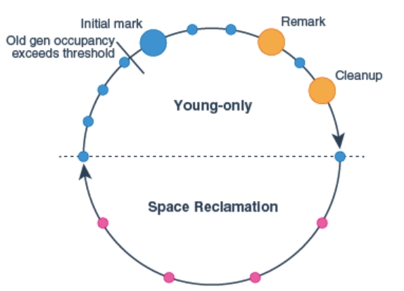

# D3 assessment preparation

## **Table of contents**

1. [Inversion of Control](#Inversion-of-Control)
2. [SOLID Principles](#SOLID-Principles)
3. [Brooks law](#Brooks-law)
4. [Spring containers](#Spring-containers)
5. [Spring beans](#Spring-beans)
6. [Instantiating beans](#Instantiating-beans)
7. [Enterprise bean overview](#Enterprise-Bean-overview)
8. [Spring bean scopes](#Spring-bean-scopes)
9. [Difference between Spring and SpringBoot](#Difference-between-Spring-and-SpringBoot)
10. [SOAP VS. REST](#SOAP-VS-REST)
11. [REST](#REST)
12. [Java memory model](#Java-Memory-Model)
13. [Java Garbage Collection](#Java-Garbage-collection-type)
14. [The CMS Collector](#The-CMS-collector)
15. [G1 collector](#G1-collector)
16. [Java 8 PermGen and Metaspace](#Java-8-PermGen-and-Metaspace)
17. [SDLC](#SDLC)
18. [CI/CD](#CI/CD)
19. [Interview questions](#Senior-Interview-questions)

## Inversion of Control

**What is Inversion of Control?**

> Inversion of Control is a principle that transfers the control of an object or portions of a program to a container or framework. IoC enables a framework to take control of the flow of a program and make calls to our custom code. To enable this, frameworks use abstractions with additional behavior built in. **If we want to add our behavior, we need to extend the classes of the framework or plugin our classes.**

The advantages of this architecture are:

- decoupling the execution of a task from its implementation
- making it easier to switch between different implementations
- greater modularity of a program
- easier testing, by making the isolation of components easier
- allowing the components to communicate through contracts

We can achieve Inversion of Control through various mechanisms such as Strategy design pattern, Service Locator pattern, and Dependency Injection(DI).

So Dependency Injection by itself is just a method to achieve Inversion of Control.

### Inversion of Control in my take

It is a principle that wants us to write code that can be used, by the framework, and not the code calling the framework.

## Dependency Injection / Dependency inversion

It is one of the many ways to achieve Inversion of Control, but one of the most commonly used ones. The main idea is to introduce abstraction, between the high-level modules, where the business logic resides, and the low-level classes, where are entities, and utility classes lie. So high-level modules should not depend on low-level modules. Both should depend on abstractions. And the abstractions should not depend on details. Details should depend on abstractions.

For dependency injection in Spring we can use:

- Constructor based
- Setter-based
- Field-based injections

## SOLID Principles

- **S: Single responsibility principle.**
  - A class should have one, and only one reason to change.
- **O: Open-Closed principle**
  - A software entity should be open for extension and closed for modification. This is achieved by the use of interfaces. The main benefit is that the interface introduces a new layer of abstraction, which enables loose coupling.
- **L: Liskov Substitution principle**
  - The principle defines that objects of a superclass shall be replaceable with objects of its subclasses without breaking the application. That requires the objects of our subclasses to behave in the same way as the objects of your superclass. This means we can enforce less restrictive validation rules, but we are not allowed to enforce stricter ones in our subclass. Similar rules apply to the return values of the method. The return values of a method of the subclass need to comply with the same rules as the return values of the method of the superclass.
- **I: Interface segregation principle**
  - In my take, this principle aims to fix the problem where interfaces lose their single responsibility, and become bloated. This should be avoided by creating new interfaces when needed, and those interfaces should have only one responsibility.
- **D: Dependency Inversion principle**
  - It is one of the many ways to achieve Inversion of Control, but one of the most commonly used ones. The main idea is to introduce abstraction, between the high-level modules, where the business logic resides, and the low-level classes, where are entities, and utility classes lie. So high-level modules should not depend on low-level modules. Both should depend on abstractions. And the abstractions should not depend on details. Details should depend on abstractions.

## Java design patterns

> There are 3 types of java design patterns, creational, structural, and behavioral design pattern. 

1. Creational design pattern:
   1. Factory pattern:
      - The factory design pattern is used when we have a superclass with multiple subclasses and based on input, we need to return on of the subclass. This pattern takes otu the responsibility of the instantiation of a class from the client program to the factory class.
   2. Abstract factory pattern:
      - In the abstract factory pattern, we get rid of the if-elso block that is in the factory pattern, and have a factory class for each subclass. Then an Abstract Factory class that will return the subclass based on the input factory class.
   3. Singleton pattern:
      - The singleton pattern restricts the instantiation of a class and ensure that only one instance of the class exists in the JVM. The singleton class must provide a global access point to get the instance of the class. It is used for logging, caching, and thread pool. This pattern is also used in other design patterns like Abstract Factory, Builder, Prototype, Facade. It has to have a private constructor, private static variable of the same class that is the only instance of the class, public static method that return the instance of the class.
   4. Prototype pattern
   5. Builder pattern

2. Structural design pattern
   1. Adapter pattern
   2. Bridge pattern
   3. Composite pattern
   4. Decorator pattern
   5. Flyweight pattern
   6. Proxy pattern

3. Behavioral design pattern
   1. Chain of responsibility pattern
   2. Command pattern
   3. Iterator pattern
   4. Mediator pattern
   5. Memento pattern
   6. Observer pattern
   7. State pattern
   8. Strategy pattern
   9. Template pattern
   10. Visitor pattern

## Brooks law

Brooks's law is an observation about software project management according to which "adding manpower to a late software project makes it later".

The main factors that explain why it works this way:

1. It takes some time for the people added to a project to become productive. Brooks calls this the "ramp-up" time. Software projects are complex engineering endeavors, and new workers on the project must first become educated about the work that has preceded them; this education requires diverting resources already working on the project, temporarily diminishing their productivity while the new workers are not yet contributing meaningfully. Each new worker also needs to integrate with a team composed of several engineers who must educate the new worker in their area of expertise in the code base, day by day. In addition to reducing the contribution of experienced workers (because of the need to train), new workers may even make negative contributions, for example, if they introduce bugs that move the project further from completion.
2. Communication overhead increases as the number of people increases. Due to the combinatorial explosion, the number of different communication channels increases rapidly with the number of people. Everyone working on the same task needs to keep in sync, so as more people are added they spend more time trying to find out what everyone else is doing.
3. Adding more people to a highly divisible task, such as cleaning rooms in a hotel, decreases the overall task duration (up to the point where additional workers get in each other's way). However, other tasks including many specialties in software projects are less divisible; Brooks points out this limited divisibility with another example: while it takes one woman nine months to make one baby, "nine women can't make a baby in one month".

## Spring containers

The container will create the objects, wire them together, configure them, and manage their complete life cycle from creation to destruction. The Spring container uses Dependency Injection, to manage the components that make up the application. These objects are called Spring Beans. The container gets its instructions by reading the configuration metadata. The metadata can be XML, java annotations or java code.

Spring provides two types of container

- Spring BeanFactory Container
- Spring ApplicationContext Container (Its a sub-interface of the BeanFactory)

The ApplicationContext container includes all functionality of the Bean Factorycontainer, so it's generally recommended over BeanFactory. The basis of the IoC container is the org.springframework.beans and org.springframework.context packages.

## Spring Beans

In Spring, the object that forms the backbone of the application and that are managed by the Spring IoC container are called beans. A bean is an object that is instantiated, assembled, and otherwise managed by a Spring IoC container. Beans, and the dependencies among them, are reflected in the configuration metadata (XML, java annotations, or java code) used by a container.

> **The interface org.springframework.context.ApplicationContext represents the Spring IoC container and is responsible for instantiating, configuring, and assembling the spring beans.**

The following diagram is a high-level view of how Spring works. The application classes are combined with configuration metadata so that after the ApplicationContext is created and initialized, we have a fully configured application.

&nbsp;

&nbsp;

The bean definitions correspond to the actual object that makes up the application. Typically we define service layer objects, data access objects, presentation objects, JSM  and so forth. It's now recommended to configure fine-grained domain objects in the container because it's not its responsibility.

### Instantiating a spring container

Instantiating a Spring IoC container is straightforward. The location path or paths supplied to an ApplicationContext constructor are resource strings that allow the container to load configuration metadata from a variety of external resources such as the local file system, the Java CLASSPATH, and so on.

```java
public class Test {
ApplicationContext context =
    new ClassPathXmlApplicationContext(new String[] {"services.xml", "daos.xml"});
}
```

### Bean overview

Within the container, these bean definitions are represented as ```BeanDefinition``` objects, which contain the following metadata:

- class
- name
- scope
- constructor arguments
- properties
- auto wiring mode
- lazy-initialization mode
- initialization method
- destruction method

In addition to bean definitions that contain information on how to create a specific bean, the ```ApplicationContext``` implementations also permit the registration of existing objects that are created outside the container, by users. This is done by accessing the ApplicationContext's BeanFactory via the method getBeanFactory() which returns the BeanFactory implementation DefaultListableBeanFactory. ```DefaultListableBeanFactory``` supports this registration through the methods ```registerSingleton(..)``` and ```registerBeanDefinition(..)```. However, typical applications work solely with beans defined through metadata bean definitions.

### Naming beans

Every bean has one or more identifiers. These identifiers must be unique within the container that hosts the bean. A bean usually has only one identifier, but if it requires more than one, the extra ones can be considered aliases.

> Bean naming conventions
>
> The convention is to use the standard Java convention for instance field names when naming beans.

### Aliasing a bean outside the bean definition

In a bean definition itself, you can supply more than one name for the bean, by using a combination of up to one name specified ```id``` attribute, and any number of other names in the ```name``` attribute.

Examples:

```xml
<aliases>
    <alias name="subsystemA-dataSource" alias="subsystemB-dataSource"/>
    <alias name="subsystemA-dataSource" alias="myApp-dataSource"/>
</aliases>
```

## Instantiating beans

## Enterprise Bean overview

Enterprise beans are Java EE components that implement Enterprise JavaBeans (EJB) technology. Enterprise beans run in the EJB container, a runtime environment within the GlassFish server. (The GlassFish server is a Java EE 6 platform implementation. It includes a number of Java EE tools that are not part of the Java EE 6 platform, but are provided as a convenience to the developer.)

The EJB container provides system-level services, such as transactions, and security, to its enterprise beans.

### What is an Enterprise Bean

The enterprise bean is a server-side component that encapsulates the business logic of an application.

### Benefits of Enterprise Beans

Enterprise beans simplify the development of large distributes applications. EJB provides system-level services to enterprise beans, the bean developer can concentrate on solving business problems. EJB are portable components, the application assembler can build new applications from existing beans. Provided that they use the standard APIs, these applications can run on any compliant Java EE server.

Table of enterprise bean types


| Enterprise Bean Type | Purpose                                                                                  |
|----------------------|------------------------------------------------------------------------------------------|
| Session              | Performs a task for a client; optionally, may implement a web service                    |
| Message-driven       | Acts as a listener for a particular messaging type, such as the Java Message Service API |

### What is a session bean

A session bean encapsulates business logic that can be invoked programmatically by a client over local, remote, or web service client views. The session bean performs work for its client, shielding it from complexity by executing business tasks inside the server.

### Types of session beans

**There are three types of session beans:**

1. stateful
2. stateless
3. singleton

### Stateful session beans

The state of an object consists of the values of its instance variables. In a **stateful session bean**, the instance variables represent the state of a unique client/bean session. Because of the client's interactions with its bean, this state is often called the **conversational state**.

A session bean is similar to an interactive session. A session bean is not shared; it can have only one client, in the same way, that an interactive session can have only one user. When the client is terminated, its session bean appears to terminate and is no longer associated with the client.

### Stateless session beans

A **stateless session bean** does not maintain a conversational state with the client. When a client invokes the methods of a stateless bean, the bean's instance variables may contain a state specific to that client but only for the duration of the invocation. When the method is finished, the client-specific state should not be retained. Clients may change the state of instance variables in pooled stateless beans, and this state is held over to the next innovation of the pooled stateless beans.

> A stateless session bean can implement a web service, but a stateful session bean cannot.

### Singleton session beans

A **singleton session bean** is instantiated once per application and exists for the lifecycle of the application. Singleton session beans are designed for circumstances in which a single enterprise bean instance is shared concurrently accessed by clients.

> Like stateless session beans, singleton session beans can implement web service endpoints.

Singleton session beans maintain their state between client invocations but are not required to maintain their state across server crashes or shutdowns.

### When to use session beans

Stateful session beans are appropriate if any of the following conditions are true.

1. The bean's state represents the interaction between the bean and a specific client.
2. The bean needs to hold information about the client across method invocations.
3. The bean mediated between the client and the other components of the application, presenting a simplified view to the client.
4. Behind the scenes, the bean manages the workflow of several enterprise beans.

To improve performance, you might choose a stateless session bean if it has any of the traits.

1. The bean's state has no data for a specific client.
2. In a single method invocation, the bean performs a generic task for all clients. For example, you might use a stateless session bean to send an email that confirms an online order.
3. The bean implements a web service.

Singleton session beans are appropriate in the following circumstances. The state needs to be shared across the application.

1. A single enterprise bean needs to be accessed by multiple threads concurrently.
2. The application needs an enterprise bean to perform tasks up to application startup and shutdown.
3. The bean implements a web service.

## Spring bean scopes

The scope of a bean defines the life cycle and visibility of that bean in the contexts we use it.

The latest version of the Spring framework defines 6 types of scopes:

1. [Singleton](#Singleton)
2. [Prototype](#Prototype)
3. [Request](#Request)
4. [Session](#Session)
5. [Application](#Application)
6. [Websocket](#WebSocket)

### Singleton

When we define a bean with the singleton scope, the container creates a single instance of that bean, and all requests for that bean name will return the same object, which is cached. Any modifications to the object will be reflected in all references to the bean. This scope is the default value if no other scope is specified.

### Prototype

A bean with the prototype scope will return a different instance every time it is requested from the container. It is defined by setting the value prototype to the @Scope annotation in the bean definition.

### Request

The request scope creates a bean instance for a single HTTP request, while the session scope creates a bean instance for an HTTP session. The application scope creates the bean instance for the lifecycle of a ServletContext, and the WebSocket scope creates it for a particular WebSocket session.

How to define a request scope:

```java
public class Test {
@Bean
@Scope(value = WebApplicationContext.SCOPE_REQUEST, proxyMode = ScopedProxyMode.TARGET_CLASS)
public HelloMessageGenerator requestScopedBean() {
    return new HelloMessageGenerator();
    }
}
```

The proxy mode attribute is necessary because, at the moment of the instantiation of the web application context, there is no active request. Spring creates a proxy to be injected as a dependency and instantiates the target bean when it is needed in a request.

### Session

How to define a bean with session scope:

```java
public class Test {
@Bean
@Scope(value = WebApplicationContext.SCOPE_SESSION, proxyMode = ScopedProxyMode.TARGET_CLASS)
public HelloMessageGenerator sessionScopedBean() {
    return new HelloMessageGenerator();
    }

// There's also a dedicated composed annotation we can use to simplify the bean definition:

@Bean
@SessionScope
public HelloMessageGenerator sessionScopedBean() {
    return new HelloMessageGenerator();
    }
}
```

Next, we define a controller with a reference to the session scoped bean. Again, we need to run two requests to show that the value of the message field is the same for the session.

In that case, when the request is made for the first time, the value message is null. However, once it is changed, that value is retained for subsequent requests as the same instance of the bean is returned for the entire session.

```java
@Controller
public class ScopesController {
    @Resource(name = "sessionScopedBean")
    HelloMessageGenerator sessionScopedBean;

    @RequestMapping("/scopes/session")
    public String getSessionScopeMessage(final Model model) {
        model.addAttribute("previousMessage", sessionScopedBean.getMessage());
        sessionScopedBean.setMessage("Good afternoon!");
        model.addAttribute("currentMessage", sessionScopedBean.getMessage());
        return "scopesExample";
    }
}
```

### Application

The application scope creates the bean instance for the lifecycle of a ServletContext. This is similar to the singleton scope, but there is a very important difference in the scope of the bean. When beans are application scoped, the same instance of the bean is shared across multiple servlet-based applications running in the same ServletContext, while singleton scoped beans are scoped to a single application context only.

```java
public class Test {
@Bean
@Scope(
  value = WebApplicationContext.SCOPE_APPLICATION, proxyMode = ScopedProxyMode.TARGET_CLASS)
public HelloMessageGenerator applicationScopedBean() {
    return new HelloMessageGenerator();
}

// Analogous to the request and session scopes, we can use a shorter version:

@Bean
@ApplicationScope
public HelloMessageGenerator applicationScopedBean() {
    return new HelloMessageGenerator();
}

// Now let's create a controller that references this bean:

@Controller
public class ScopesController {
    @Resource(name = "applicationScopedBean")
    HelloMessageGenerator applicationScopedBean;

    @RequestMapping("/scopes/application")
    public String getApplicationScopeMessage(final Model model) {
        model.addAttribute("previousMessage", applicationScopedBean.getMessage());
        applicationScopedBean.setMessage("Good afternoon!");
        model.addAttribute("currentMessage", applicationScopedBean.getMessage());
        return "scopesExample";
        }
    }
}
```

### WebSocket

When first accessed, WebSocket scoped beans are stored in the WebSocket session attributes. The same instance of the bean is then returned whenever that bean is accessed during the entire WebSocket session. We can also say that it exhibits singleton behavior but is limited to a WebSocket session only.

## Difference between Spring and SpringBoot

### Spring

Spring provides comprehensive infrastructure support for developing Java applications. It's packed with some nice features like Dependency Injection, and out-of-the-box modules like:

1. Spring JDBC
2. Spring MVC
3. Spring Security
4. Spring AOP
5. Spring ORM
6. Spring Test

### Spring boot

Spring boot is an extension of the Spring framework, which eliminates the boilerplate configurations required for setting up a Spring application. It takes an opinionated view of the Spring platform, which paves the way for a faster and more efficient development ecosystem.


| Spring                                                                                  | Spring Boot                                                                                                                                                     |
|-----------------------------------------------------------------------------------------|-----------------------------------------------------------------------------------------------------------------------------------------------------------------|
| Spring Framework is a widely used Java EE framework for building applications.          | Spring Boot Framework is widely used to develop REST APIs.                                                                                                      |
| It aims to simplify Java EE development that makes developers more productive.          | It aims to shorten the code length and provide the easiest way to develop Web Applications.                                                                     |
| The primary feature of the Spring Framework is dependency injection.                    | The primary feature of Spring Boot is Autoconfiguration. It automatically configures the classes based on the requirement.                                      |
| It helps to make things simpler by allowing us to develop loosely coupled applications. | It helps to create a stand-alone application with less configuration.                                                                                           |
| The developer writes a lot of code (boilerplate code) to do the minimal task.           | It reduces boilerplate code.                                                                                                                                    |
| To test the Spring project, we need to set up the sever explicitly.                     | Spring Boot offers embedded server such as Jetty and Tomcat, etc.                                                                                               |
| It does not provide support for an in-memory database.                                  | It offers several plugins for working with an embedded and in-memory database such as H2.                                                                       |
| Developers manually define dependencies for the Spring project in pom.xml.              | Spring Boot comes with the concept of starter in pom.xml file that internally takes care of downloading the dependencies JARs based on Spring Boot Requirement. |


| Spring Boot                                                                                          | Spring MVC                                                                            |
|------------------------------------------------------------------------------------------------------|---------------------------------------------------------------------------------------|
| Spring Boot is a module of Spring for packaging the Spring-based application with sensible defaults. | Spring MVC is a model view controller-based web framework under the Spring framework. |
| It provides default configurations to build Spring-powered framework.                                | It provides ready to use features for building a web application.                     |
| There is no need to build configuration manually.                                                    | It requires build configuration manually.                                             |
| There is no requirement for a deployment descriptor.                                                 | A Deployment descriptor is required.                                                  |
| It avoids boilerplate code and wraps dependencies together in a single unit.                         | It specifies each dependency separately.                                              |
| It reduces development time and increases productivity.                                              | It takes more time to achieve the same.                                               |

## SOAP-VS-REST

### SOAP

Simple Object Access Protocol (SOAP) is a standard network protocol that was first designed so that applications built with different languages and on different platforms could communicate. Because it is a protocol, it imposes built-in rules that increase its complexity and overhead, which can lead to long page load times. These built-in compliance's can make it preferable for enterprise scenarios. It also implements SSL as well. It's a contract based protocol.

It includes standards such as security, atomicity, consistency, isolation, and durability (ACID), which is a set of properties for ensuring reliable database transactions.

It uses XML format to transfer messages. It works on top of application layer protocols like HTML, SMTP and TCP for notations and transmission.

> Both SOAP requests and responses are transported using HTTPS or a similar protocol like HTTP.

**Message format:**

SOAP message transmits some basic information as given below:

- Information about message structure and instructions on processing it.
- Encoding instructions for application-defined data types.
- Information about Remote Procedure Calls and their responses.

**The message in XML format contains three parts:**

1. Envelope: It specifies that the XML message is a SOAP message. A SOAP message can be defined as an XML document containing a header and body encapsulated in the envelope. The fault is within the body of the message.
2. Header: This part is not mandatory. But when it is present it can provide crucial information about the applications.
3. Body: It contains the actual message that is being transmitted. The fault is contained within the body tags.
4. Fault: This section contains the status of the application and also contains errors in the application. This section is also optional. it should not appear more than once in a SOAP message.

**Sample Message:**

```xml
<env:Envelope xmlns:env="http://www.w3.org/2003/05/soap-envelope">
    <env:Header>
        <m:GetLastTradePrice xmlns:m="Some-URI" />
    </env:Header>
    <env:Body>
        <!-- <symbol xmlns:p="Some-URI" >DIS</symbol> -->
    </env:Body>
</env:Envelope>
```

### SOAP advantages

SOAP is an integral part of the service-oriented architecture (SOA) and the web services specifications.

1. **Platform- and operating system-independent.** SOAP can be carried over a variety of protocols, enabling communication between applications with different programming languages on both Windows and Linux.
2. **Works on the HTTP protocol.** Even though SOAP works with many protocols, HTTP is the default protocol used by web applications.
3. **Can be transmitted through different networks and security devices.** SOAP can be easily passed through firewalls, where other protocols might require special accommodation.

### SOAP disadvantages

1. **No provision for passing data by reference.** This can cause synchronization issues if multiple copies of the same object are passed simultaneously.
2. **Speed.** The data structure of SOAp is based on CML. CML is largely human-readable, which makes it fairly easy to understand a SOAP message. However, that also makes the messages relatively large compared to the Common Object Request Broker Architecture (CORBA) and its remote procedure call (RPC) protocol that will accommodate binary data. Meaning CORBA and RPC are faster. Low throughput
3. **Not as flexible as other methods.** Although SOAP is flexible, newer methods, such as RESTful architecture, use XML, JSON, YAML or any parser needed, which makes them more flexible than SOAP.

## REST

REST is an acronym for **RE**presentational **S**tate **T**ransfer and an architectural style for distributed hypermedia systems. Like other architectural styles, REST has its guiding principles and constraints. These principles must be satisfied if a service interface needs to be referred to as RESTful.

> A Web API (or Web Service) conforming to the REST architectural style is a REST API.

### The 6 guiding principles of REST

1. **Uniform interface:** By applying the principle of generality to the components interface, we can simplify the overall system architecture and improve the visibility of interactions. The following four constraints can achieve a uniform REST interface.

   1. **Identification of resources** - The interface must uniquely identify each resource involved in the interaction between the client and the server.
   2. **Manipulation of resources through representations** - The resources should have uniform representations in the server response. API consumers should use these representations to modify the resource state in the server.
   3. **Self-descriptive messages** - Each resource representation should carry enough information to describe how to process the message. It should also provide information on the additional actions that the client can perform on the resource.
   4. **Hypermedia as the engine of application state** - The client should have only the initial URI of the application. the client application should dynamically drive all other resources and interactions with the use of hyperlinks.
2. **Client-Server:** The client-server design pattern enforces the separation of concerns, which helps the client and the server components evolve independently. While the client and the server evolve, we have to make sure that the interface/contract between the client and the server does not break.
3. **Stateless:** Statelessness mandates that each request from the client to the server must contain all of the information necessary to understand and complete the request. The server cannot take advantage of any previously stored context information on the server.
4. **Cacheable:** The cacheable constraint requires that a response should implicitly or explicitly label itself as cacheable or non cacheable. If the response is cacheable, the client application gets the right to reuse the response data later for equivalent requests and a specified period.
5. **Layered system:** The layered system style allows an architecture to be composed of hierarchical layers by constraining component behavior. For example, in a layered system, each component cannot see beyond the immediate layer they are interacting with.
6. **Code on Demand (Optional):** REST also allows client functionality to extend by downloading and executing code in the form of applets or scripts. The downloaded code simplifies clients by reducing the number of features required to be pre-implemented. Servers can provide part of features delivered to the client in the form of code, and the client only needs to execute the code.
7. **By Peti:** Discoverable which is Layered and Uniformed together.

## Java Memory Model

### Introduction:
To run an application in an optimal way, JVM divides memory into stack and heap memory. Whenever we declare new variables and objects, call a new method, declare a String, or perform similar operations, JVM designates memory to these operations from either Stack Memory or Heap Space.

### Stack memory in Java
Stack Memory in Java is used for static memory allocation and the execution of a thread. It contains primitive values that are specific to a method and references to objects referred from the method that are in a heap.


Access to this memory is in Last-In-First-Out (LIFO) order. Whenever we call a new method, a new block is created on top of the stack which contains values specific to that method, like primitive variables and references to objects.


When the method finishes execution, its corresponding stack frame is flushed, the flow goes back to the calling method, and space becomes available for the next method.

#### Key features of stack memory
Some other features of stack memory include:
- It grows and shrinks as new methods are called and returned, respectively.
- Variables inside the stack exist only as long as the method that created them is running.
- It’s automatically allocated and deallocated when the method finishes execution.
- If this memory is full, Java throws java.lang.StackOverFlowError.
- Access to this memory is fast when compared to heap memory.
- This memory is thread-safe, as each thread operates in its own stack.

### Heap space in java
Heap space is used for the dynamic memory allocation of Java objects and JRE classes at runtime. New objects are always created in heap space, and the references to these objects are stored in stack memory.


These objects have global access, and we can access them from anywhere in the application.


We can break this memory model down into smaller parts, called generations, which are:
- Young Generation – this is where all new objects are allocated and aged. A minor Garbage collection occurs when this fills up.
- Old or Tenured Generation – this is where long surviving objects are stored. When objects are stored in the Young Generation, a threshold for the object’s age is set, and when that threshold is reached, the object is moved to the old generation.
- Permanent Generation – this consists of JVM metadata for the runtime classes and application methods

#### Key features of java heap memory
Some other features of heap space include:

- It’s accessed via complex memory management techniques that include the Young Generation, Old or Tenured Generation, and Permanent Generation.
- If heap space is full, Java throws java.lang.OutOfMemoryError.
- Access to this memory is comparatively slower than stack memory
- This memory, in contrast to stack, isn’t automatically deallocated. It needs Garbage Collector to free up unused objects so as to keep the efficiency of the memory usage.
- Unlike stack, a heap isn’t threadsafe and needs to be guarded by properly synchronizing the code.

Short introduction of what is Java stack and heap memory.

Code snipped to understand memory usage:

```java
public class Memory {

 public static void main(String[] args) { // Line 1
  int i=1; // Line 2
  Object obj = new Object(); // Line 3
  Memory mem = new Memory(); // Line 4
  mem.foo(obj); // Line 5
 } // Line 9

 private void foo(Object param) { // Line 6
  String str = param.toString(); //// Line 7
  System.out.println(str);
 } // Line 8

}
```

Picture to help understand the code snipped better


**What happens when we execute the program:**

1. As soon as we run the program, it loads all the Runtime classes into the Heap space. When the main()methods is found at line1, Java Runtime created stack memory to be used by main() method thread.
2. We are creating primitive local variable at line 2, so it's created and stored in the stack memory of main() method.
3. We are creating an Object in the 3rd line, it's created in heap memory and stack memory contains the reference for it. A similar process occurs when we create Memory object in the 4th line.
4. Now when we call the foo() method in the 5th line, a block in the top of the stack is created to be used by the foo() method. since Java is pass-by-value, a new reference to Object is created in the foo() stack block in the 6th line.
5. A string is created in the 7th line, it goes in the String pool in the heap space and a reference is created in the foo() stack space for it.
6. foo() method is terminated in the 8th line, at this time memory block allocated for foo() in stack becomes free.
7. In line 9, main() method terminated and the stack memory created for main() method is destroyed. Also, the program ends at this line, hence Java Runtime frees all the memory and ends the execution of the program.

### **Difference between Java Heap Space and Stack memory**

1. Heap memory is used by all the parts of the application whereas stack memory is used only by one thread of execution.
2. Whenever an object is created, it's always stored in the Heap space and stack memory contains the reference to it. Stack memory only contains local primitive variables and reference variables to objects in heap space.
3. Objects stored in the heap are globally accessible whereas stack memory can't be accessed by other threads.
4. Memory management in stack is done in LIFO manner whereas it's  more complex in Heap memory because it's used globally.
5. Stack memory is short-lived whereas heap memory lives from the start till the end of application execution.
6. We can use -Xms and Xmx JVM option to define the startup size and maximum size of heap memory. We can use -Xss to define the stack memory size.
7. When stack memory is full, Java runtime throws `java.lang.StackOverFlowError`, whereas if heap memory is full, it throws `java.lang.OutOfMemoryError: Java Heap Space error`.

### Java stack memory

> Stack Memory ins Java is used for static memory allocation and the execution of a thread.

It contains primitive values that are specific to a method and references to objects referred from the methods that are in a heap. Access to this memory is in Last-In-First-Out (LIFO) order. Whenever we call a new method a new block is created on top of the stack which contains values specific to that method, like primitive variables and references to objects. When the method finished execution, its corresponding stack frame is flushed, the flow goes back to the calling method, and space becomes available for the next method. Stack memory size is much smalled compared to Heap memory.

**Key features of stack memory:**

- It grows and shrinks as new methods are called and returned, respectively.
- Variables inside the stack exist only as long as the method that created them is running.
- It's automatically allocated and deallocated when the method finished execution.
- If this memory is full, Java throws java.lang.StackOverFlowError.
- Access to this memory is fast when compared to heap memory.
- This memory is thread-safe, as each thread operates in its own stack.

### Java heap memory

> Heap space is used for the dynamic memory allocation of Java objects and JRE classes at runtime. This is shared memory, multiple threads can reach it.

New objects are always created in heap space, and the references to these objects are stored in stack memory. These objects have global access, and we can access them from anywhere in the application. Garbage Collection runs on the heap memory to free the memory used by objects that don't have any reference.

**Key features of Java Heap Memory:**

- It's accessed via complex memory management techniques that include Young Generation, Old or Tenured Generation, and Permanent Generation.
- If heap space is full, Java throws java.lang.OutOfMemoryError.
- Access to this memory is comparatively slower than stack memory.
- This memory, in contrast to stack, isn't automatically deallocated. It needs Garbage Collector to free up unused objects to keep the efficiency of the memory usage.
- Unlike stack, a heap isn't thread safe and needs to be guarded by properly synchronizing the code.


JVM memory is divided into separate parts. At a broad level, JVM Heap memory is physically divided into two parts - **Young Generation** and **Old Generation**.

### **Memory Management in Java - Young Generation**

The young generation is the place where all the new objects are created. When the young generation is filled, garbage collection is performed. This garbage collection is called **Minor GC**. Young Generation is divided into three parts - **Eden Memory** and two **Survivor Memory** spaces. Important point about Young Generation Spaces:

- Most of the newly created objects are located in the Eden memory space.
- When Eden space is filled with objects, Minor GC is performed and all the survivor objects are moved to one of the survivor spaces.
- Minor GC also checks the survivor objects and moves them to the other survivor space. So at a time, one of the survivor space is always empty.
- Objects that survived after many cycles of GC are moved to the Old generation memory space. usually, it's done by setting a threshold for the age of the young generation objects before they become eligible to promote to Old Generation.

### **Memory management in Java - Old Generation**

Old Generation memory contains the objects that are long-lived and survived after many rounds of Minor GC. Usually, garbage collection is performed in Old Generation memory when it's full. Old Generation Garbage Collection is called **Major GC** and usually takes a longer timer.

### **Stop the World Event**

All the Garbage collections are "Stop the World" events because all the application threads are stopped until the operation completes. Young generation keeps short-lived objects, so Minor GC is very fast and the application doesn't get affected by this. However, Major GC takes a long time because it checks all the live objects. Major GC should be minimized because it will make your application unresponsive for the garbage collection duration. The duration taken by garbage collector depends on the strategy used for garbage collection.

### **Permanent Generation**

Permanent Generation of "Perm Gen" contains the application metadata required by the JVM to describe the classes and methods used in the application. Perm Gen is not part of Java Heap memory. Perm Gen is populated by JVM at runtime based on the classes used by the application. Perm Gen also contains Java SE library classes and methods. Perm Gen object are garbage collected in a full garbage collection.

### **Method Area**

Method Are is part of space in the Perm Gen and used to store class structure (runtime constants and static variables) and code for methods and constructors.

### **Memory Pool**

Memory Pools are created by NVM memory managers to create a pool of immutable objects if the implementation supports it. String Pool is a good example of this king of memory pool. Memory Pool can belong gto Heap or Perm Gen, depending on the JVM memory manager implementation.

### **Runtime Constant Pool**

Runtime constant pool is a per-class runtime representation of constant pool in a class. It contains class runtime constants and static methods. Runtime constant pool is part of the method area.

### **Java Heap Memory Switches**


|   **VM Switch**   | **VM Switch Description**                                                                                                                                                                                                                          |
|:-----------------:|----------------------------------------------------------------------------------------------------------------------------------------------------------------------------------------------------------------------------------------------------|
|       -Xms        | For setting the initial heap size when JVM starts                                                                                                                                                                                                  |
|       -Xmx        | For setting the maximum heap size.                                                                                                                                                                                                                 |
|       -Xmn        | For setting the size of the Young Generation, rest of the space goes for Old Generation.                                                                                                                                                           |
|    -XX:PermGen    | For setting the initial size of the Permanent Generation memory                                                                                                                                                                                    |
|  -XX:MaxPermGen   | For setting the maximum size of Perm Gen                                                                                                                                                                                                           |
| -XX:SurvivorRatio | For providing ratio of Eden space and Survivor Space, for example if Young Generation size is 10m and VM switch is -XX:SurvivorRatio=2 then 5m will be reserved for Eden Space and 2.5m each for both the Survivor spaces. The default value is 8. |
|   -XX:NewRatio    | For providing ratio of old/new generation sizes. The default value is 2.                                                                                                                                                                           |

## Java Garbage collection type

### Garbage collection in Java

<p>In Java, the programmers don't need to take care of destroying the objects that are out of use. The Garbage Collector takes care of it. </p>

Garbage Collector is a Daemon thread that keeps running in the background. Basically it frees up the heap memory by destroying the unreachable objects.

> Unreachable objects are the ones that are no longer referenced by any part of the program. We can choose the garbage collector for our java program through JVM options.

### How automatic garbage collection works

It is a process of looking at the heap memory, and marking the unreachable objects, and destroying them with compaction. 

### Generational garbage collection

In this method, the Heap space is divided into generations like Young generation heap space is the where all the new Objects are created. When it is filled up, minor garbage collection takes place. This process kills all the dead objects, and it is quick. The surviving objects eventually if they live long enough will be moved to the old generation.

The Old Generation is used to store long surviving objects. Eventually, the old generation needs to be collected. This event is called a Major GC. Often it is much slower because it involves all live objects. Also, there is Full GC, which means cleaning the entire heap.

## The CMS collector

The CMS collector ("concurrent-mark-sweep") algorithm uses multiple threads ("concurrent") to scan through the heap for unused objects that can be recycled. This collector goes in Stop-The-World(STW) mode in two cases:
1. While initializing the initial marking of roots, i.e. objects in the old generation that are reachable from thread entry points or static variables.
2. When the application has changed the state of the heap while the algorithm was running concurrently and forcing it to go back and do some final touched to make sure it has the right objects marked.

This collector may face promotion failures. If some objects from young generation are to be moved to the old generation, and the collector did not have enough time to make space in the old generation space, a promotion failure will occur. In order to prevent this, we may provide more of the heap size to the old generation or provide mode background threads to the collector.

## G1 collector

The Garbage-First collector designed for heap sizes greater than 4GB. It divides the heap size into regions spanning from 1MB to 32MB, based on the heap size. There is a concurrent global marking phase to determine the liveliness of objects throughout the heap. After the marking phase is complete, G1 knows which regions are mostly empty. It collects unreachable objects from these regions first, which usually yields a large amount of free space. So G1 collects these regions (containing garbage) first, and hence the name. G12 also uses a pause prediction model in order to meet a user-defined pause time target. It selects the number of regions to collect based on the specified pause time target. 

**The G1 garbage collection cycle includes the phases shown in the figure:**
<br></br>

<br></br>
1. **Young only Phase:** This phase includes only the young generation objects and promotes them to the old generation. The transition between the young-only phase and the space-reclamation phase starts when the old generation is occupied up to a certain threshold, i.e. the Initiation Heap Occupancy threshold. At this time, G1 schedules an Initial Mark young-only collection instead of a regular young-only collection.
2. **Initial Marking:** This type of collection starts the marking process in addition to a regular young-only collection. Concurrent marking determines all currently live objects in the old generation regions to be kapt for the following space-reclamation phase. While marking hasn't completely finished, regular young-only collections may occur. Marking finished with two special stop-the-world pauses: Remark and Cleanup.
3. **Remark:** This pause finalizes the marking itself, and performs global reference processing and class unloading. Between Remark and Cleanup G1 calculates a summary of the liveliness information concurrently, which will be finalized and used in the Cleanup pause to update internal data structures.
4. **Cleanup:** This pause also takes the completely empty regions, and determines whether a space-reclamation phase will actually follow. If a space-reclamation phase follows, the young-only phase completes with a single young-only collection.
5. Space-reclamation phase:** This phase consists of multiple mixed collections in addition to young generation regions, also evacuates live objects of old generation regions. the space-reclamation phase ends when G1 determines that evacuating more old generation regions wouldn't yield enough free space worth the effort.

G1 can be enabled using the ```-XX:+UseG1GC``` flag. This strategy reduced the chances of the heap being depleted before the background threads have finished scanning for unreachable objects. Also, it compacts the heap on-the-go, which the CMS collector can only do in STW mode. In Java 8 a cool optimization is provided with G1 collector, called string deduplication. A new optimization has been made that enables the G1 collector to identify strings which are duplicated more than once across our heap and modify them to point to the same internal char[] array, to avoid multiple copies of the same string resign in the heap unnecessarily. We can use the ```-XX+UseStringDeduplication``` to enables this optimization. **G1 is the default garbage collector in JDK 9**

## Java 8 PermGen and Metaspace

As mentioned earlier, the Permanent Generation space was removed since Java 8. So now, the JDK 8 HotSpot JVM uses the native memory for the representation of class metadata which is called Metaspace. Most of the allocations for the class metadata are made out of the native memory. Also, there is a new flag MaxMetaspaceSize, to limit the amount of memory used for class metadata. If we do not specify the value for this, the Metaspace re-sizes at runtime as per the demand of the running application. Metaspace garbage collection is triggered when the class metadata usage reaches MaxMetaspaceSize limit. Excessive Metaspace garbage collection may be a symptom of classes, classloaders memory leak or inadequate sizing for our application. That’s it for the Garbage Collection in java. I hope you got the understanding about different garbage collectors we have in java.

## Polymorphism

There are two types of polymorphism in java:
- Compile time polymorphism
- Runtime  polymorphism

### Compile time polymorphism
Compile-time polymorphism is achieved through method overloading. In method overloading, methods in the same calls have the same name but different parameters. The compiler knows which method to call bases on the methods signature, which included the method name, and the number and types of parameters. This is determined at compile-time.

### Runtime polymorphism (Dynamic Polymorphism)
Runtime polymorphism is achieved through method overriding. In Java, we mark a method in the subclass with the same, return type, and parameters as a method in the superclass with the '@Override' annotation. This tells the Java compiler that we intend to override a method from the superclass in the subclass. It's achieved via using either inheritance or interface.

## V-table (Virtual method table)
A v-table is a table of function pointers (or method pointers). Pointers = references. Each class with virtual methods (methods that can be overridden) has its own v-table. When an object is created a reference to the v-table of its class is stored as part of that object's data.

### How does it work?
When a method is called on an object, the method to execute is looked up in the v-table, and the appropriate version of the method is invoked. If a subclass overrides a method from its superclass, the entry for that methods in the subclass's v-table points to the overridden version. When you have a reference to a superclass, but it's pointing to an object of a subclass, the method from the subclass's v-table will be invoked.

### Java and V-tables
In Java, all nin-static and non-final methods are by default "virtual functions". That means they can be overridden by sybclasses unless they are marked with the 'final' keyword, which prevents method overriding.

When an object is instantiated in Java, a v-table is created for its class if it doesn't already exist. The v-table contains one entry for each unique method signature, inherited from all its ancestors. The v-table will point to the most specific version of each method that the object's class has access to. When you call a method on an object, the JVM looks up the method in the object's v-table and invokes it.

## What is java reflection?
Java Reflection is a powerful feature that allows you to inspect, modify, and interact with class fields, methods, and constructors at runtime. This capability enabled dynamic behavior in your Java programs. With Reflection, you can:
- Obtain information about classes, interfaces, fields, and methods at runtime, even if you don't know their names at compile-time.
- Create new instances of classes.
- Get and set field values for an object.
- Invoke methods on an object.
- Create new arrays, among other functionalities.

### The four fundamental principles of Object-Oriented Programming
1. Encapsulation:

**What it is:** Encapsulation involves bundling data (fields) and methods together that manipulate the data into a single unit, or object. It also restricts direct access to some of the object's components to prevent unauthorized modification of misuse.

2. Inheritance:

**What it is:** Inheritance enables a new class (subclass) to inherit properties (fields and methods) from an existing class (superclass).

3. Polymorphism:

**What it is:** Polymorphism allows objects of different types to be treated as objects of a common super-type. The most common use is when a parent class reference is used to refer to a child class object.

4. Abstraction:
**What it is:** Abstraction means hiding the compile reality while exposing only the necessary parts. In Java, abstraction can be achieved through abstract classes and interfaces.

## SDLC
The Software Development LIfe Cycle is a structured approach in software engineering. It guides the process of developing high-quality siftware systems. It consists of phases that software goes through, from concept to deployment and maintenance.


### Different phases in SDLC
| Phase                  | Description                                                                                                                                                                                                         |
|------------------------|---------------------------------------------------------------------------------------------------------------------------------------------------------------------------------------------------------------------|
| Requirements gathering | In this phase, stakeholders and users gather and document software requirements.                                                                                                                                    |
| System design          | The system design phase involves creating a detailed plan for the software system, including architecture, user interface, and database structure.                                                                  |
| Implementation         | This phase involves coding and programming the siftware based on the design specifications. It includes writing, testing, and integrating components.                                                               |
| Testing                | In the testing phase, the software is thoroughly tested to identify and fix defects or errors. This includes unit testing, integration testing, system testing, and user acceptance testing.                        |
| Deployment             | The deployment phase involves releasing the software for production after being tested and approved. It includes installation and configuration in the target environment                                           |
| Maintenance            | The maintenance phase focuses on monitoring and maintaining the software to ensure optimal performance, security, and reliability. It involves addressing user feedback and releasing updates or patches as needed. |

### Importance of following a structured SDLC approach:
- it allows us to maintain a systematic and organized development process
- helps us identify and mitigate potential risks early on
- enables us to allocate resources efficiently and manage project effectively
- it ensures proper planning and requirement gathering to establish clear project goals
- better time and cost management results from effective resource allocation and project scheduling
- it promotes rigorous testing and quality assurance, resulting in reliable and robust software systems

### What is Software Testing Life Cycle?
The software testing life cycle is a step-by-step process used to test software and ensure it works well.

### Different phases in STLC
| Phase                  | Description                                                                                                                                                                                             |
|------------------------|---------------------------------------------------------------------------------------------------------------------------------------------------------------------------------------------------------|
| Test planning          | In this phase, we plan what and how to test. We make schedules and plans for the testing.                                                                                                               |
| Test case development  | In the test case development phase, we create instruction to check if the software work correctly. We also prepare the data needed for the tests.                                                       |
| Test environment setup | The test environment setup phase is about getting everything ready for testing. We set up the computer, software, and tools needed for the tests.                                                       |
| Test execution         | In the test execution phase, we run the tests. We check if there are any problems or mistakes in the software. We write down any issues we find.                                                        |
| Test closure           | The test closure phase is when we finish the testing. We analyze the test results, write reports about the tests, and record what we learned. We also review and close any issues found during testing. |

### Relationship between SDLC and STLC
SDLC encompasses the entire software development process, while STLC focuses explicitly on the testing phase. Both cycles work together to ensure the software's quality, functionality, and reliability.

## CI/CD
Continuous integration, deployment, and delivery refer to the code, build, test, release and deploy phases of the DevOps cycle. These phases are reflected in a software production pipeline with several stages, as shown in this picture:


### Continuous software delivery
Software delivery and deployment are the last stages of the software production pipeline. Let's explain what delivery means. From the point of view of a single developer, it may mean that a particular change was tested and merged into the main branch. **The delivery is the process of delivering the complete final software product to the customer.**


**In summary, continuous delivery is a process of delivering a software product or artifact to the final consumer at a place where it can be drawn from and used. The deployment of a new release must usually be approved by a product manager or the customer.**

### Continuous software deployment
With the rise of cloud applications that often work together with mobile applications, software complexity grew by several orders of magnitude. **For example, cloud services are running on thousands of virtual machines, and manually approving the deployment of each software release on these machines is not feasible anymore. So, the deployment of a software release is now also automated, and we refer to it as Continuous Software Deployment.


Because the released changes are small, it is also easy to automate tests to determine whether the new release works correctly. This is done in the last stage, labeled "Post-prod tests", of the "Continuous Delivery/Deployment" section of the pipeline

## Senior-Interview-questions
- What are collections in java? Tell me examples for collections. (List, Set etc.)
> **Answer:** 
> Collections are like containers that group multiple items in a single unit. Java 1.2 provided the **Collections Framework** that is the architecture to represent and manipulate Collections in java in a standard way. Examples for collections: ```HashSet, TreeSet, ArrayList, LinkedList, HashMap, TreeMap, Queue, Dequeue, SortedSet, SortedMap```. Also, there are synchronized wrappers (```Collection synchronizedCollection, Set synchronizedSet```), and unmodifiable wrappers (```Collection unmodifiableCollection, Set unmodifiableSet```).
- What methods can you override when using hashmaps? And what are those methods used for, why are they important?
> **Answer:** 
> The two methods are ```equals(), hashCode()```. The equals() is important, because that's where we specify what type of match are we looking between hashMaps. The hashCode() is important because that is the method that returns the hash code for our map, and we can provide specific type of hashing.
- What is a hashmap, and when would you consider using them?
> **Answer:** 
> It provides a basic implementation of the Map interface. It stores the data in key-value pairs, and we can access them by a key. If we insert a duplicate key, it will  replace the values of the corresponding key. Hashmap is unsynchronized. It permits null values and one null key. It provided constant-time performance for the basic operations (```get``` and ```put```).
- What is the difference between 'ArrayList' and 'LinkedList'?
> **Answer:**
> - Arraylist is backed an array, which provided constant-time access to elements by index but may involve resizing the array,making the insertion and deletion slower. ('O(n)' in the worst case).
> - ArrayList consumes less memory as compared to 'LinkedList' because it doesn't store the additional next and previous pointers.
> - 'LinkedList' is implemented using a doubly-linked list. It offers a constant-time insertions and deletions but takes 'O(n)' time to access elements by index.
> - 'LinkedList' is preferable when you have multiple insertions and deletions while 'ArrayList' is better for random access and search operations.
 
