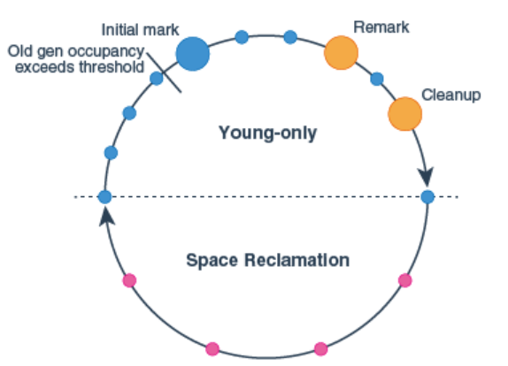
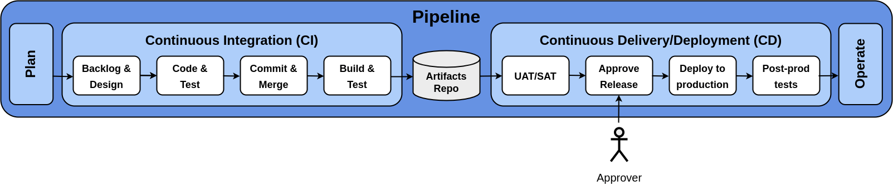
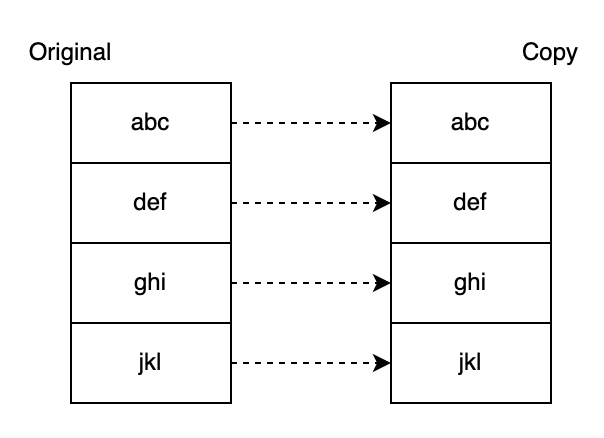
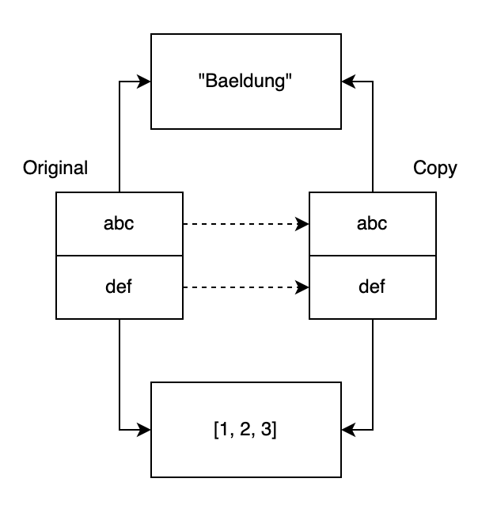
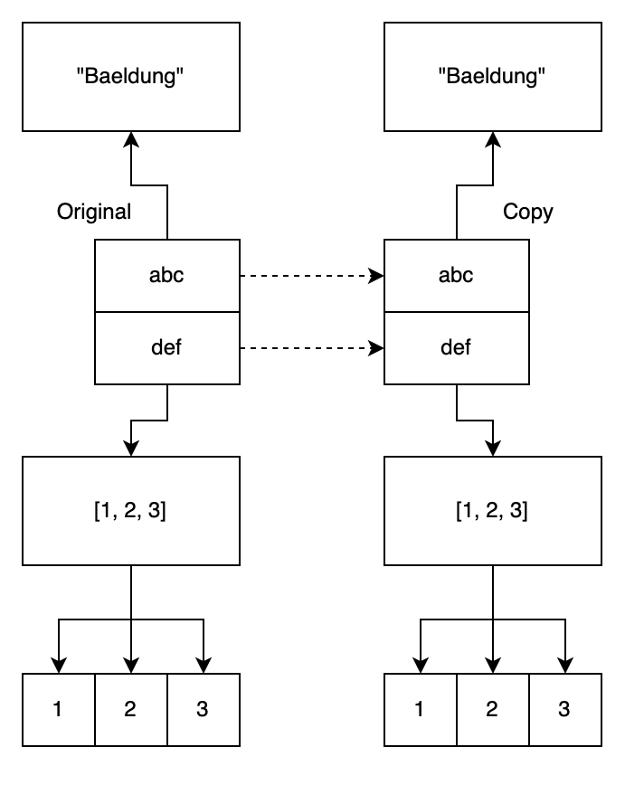

# D3 assessment preparation

<a name='d3-assessment-preparation'></a>

## **Table of contents**

<a name='table-of-contents'></a>
1. [Inversion of Control](#inversion-of-control)
2. [Inversion of Control in my take](#inversion-of-control-in-my-take)
3. [Dependency Injection / Dependency inversion](#dependency-injection--dependency-inversion)
4. [SOLID Principles](#solid-principles)
5. [Java design patterns](#java-design-patterns)
6. [Brooks law](#brooks-law)
7. [Spring containers](#spring-containers)
8. [Spring Beans](#spring-beans)
9. [Instantiating a spring container](#instantiating-a-spring-container)
10. [Bean overview](#bean-overview)
11. [Naming beans](#naming-beans)
12. [Aliasing a bean outside the bean definition](#aliasing-a-bean-outside-the-bean-definition)
13. [Instantiating beans](#instantiating-beans)
14. [Enterprise Bean overview](#enterprise-bean-overview)
15. [What is an Enterprise Bean](#what-is-an-enterprise-bean)
16. [Benefits of Enterprise Beans](#benefits-of-enterprise-beans)
17. [What is a session bean](#what-is-a-session-bean)
18. [Types of session beans](#types-of-session-beans)
19. [Stateful session beans](#stateful-session-beans)
20. [Stateless session beans](#stateless-session-beans)
21. [Singleton session beans](#singleton-session-beans)
22. [When to use session beans](#when-to-use-session-beans)
23. [Spring bean scopes](#spring-bean-scopes)
24. [Singleton](#singleton)
25. [Prototype](#prototype)
26. [Request](#request)
27. [Session](#session)
28. [Application](#application)
29. [WebSocket](#websocket)
30. [Difference between Spring and SpringBoot](#difference-between-spring-and-springboot)
31. [Spring](#spring)
32. [Spring boot](#spring-boot)
33. [SOAP-VS-REST](#soap-vs-rest)
34. [SOAP](#soap)
35. [SOAP advantages](#soap-advantages)
36. [SOAP disadvantages](#soap-disadvantages)
37. [REST](#rest)
38. [The 6 guiding principles of REST](#the-6-guiding-principles-of-rest)
39. [Java Memory Model](#java-memory-model)
40. [Stack memory in Java](#stack-memory-in-java)
41. [Key features of stack memory](#key-features-of-stack-memory)
42. [Heap space in java](#heap-space-in-java)
43. [Key features of java heap memory](#key-features-of-java-heap-memory)
44. [Difference between Java Heap Space and Stack memory](#difference-between-java-heap-space-and-stack-memory)
45. [Memory Management in Java - Young Generation](#memory-management-in-java---young-generation)
46. [Memory management in Java - Old Generation](#memory-management-in-java---old-generation)
47. [Stop the World Event](#stop-the-world-event)
48. [Permanent Generation](#permanent-generation)
49. [Method Area](#method-area)
50. [Memory Pool](#memory-pool)
51. [Runtime Constant Pool](#runtime-constant-pool)
52. [Java Heap Memory Switches](#java-heap-memory-switches)
53. [Java Garbage collection type](#java-garbage-collection-type)
54. [Garbage collection in Java](#garbage-collection-in-java)
55. [How automatic garbage collection works](#how-automatic-garbage-collection-works)
56. [Generational garbage collection](#generational-garbage-collection)
57. [The CMS collector](#the-cms-collector)
58. [G1 collector](#g1-collector)
59. [Java 8 PermGen and Metaspace](#java-8-permgen-and-metaspace)
60. [Polymorphism](#polymorphism)
61. [Compile time polymorphism](#compile-time-polymorphism)
62. [Runtime polymorphism (Dynamic Polymorphism)](#runtime-polymorphism-dynamic-polymorphism)
63. [V-table (Virtual method table)](#v-table-virtual-method-table)
64. [How does it work?](#how-does-it-work)
65. [Java and V-tables](#java-and-v-tables)
66. [What is java reflection?](#what-is-java-reflection)
67. [The four fundamental principles of Object-Oriented Programming](#the-four-fundamental-principles-of-object-oriented-programming)
68. [SDLC](#sdlc)
69. [Different phases in SDLC](#different-phases-in-sdlc)
70. [Importance of following a structured SDLC approach](#importance-of-following-a-structured-sdlc-approach)
71. [What is Software Testing Life Cycle?](#what-is-software-testing-life-cycle)
72. [Different phases in STLC](#different-phases-in-stlc)
73. [Relationship between SDLC and STLC](#relationship-between-sdlc-and-stlc)
74. [CI-CD](#ci-cd)
75. [Continuous software delivery](#continuous-software-delivery)
76. [Continuous software deployment](#continuous-software-deployment)
77. [Threads](#threads)
78. [Collections](#collections)
79. [ArrayList](#arraylist)
80. [LinkedList](#linkedlist)
81. [HashSet](#hashset)
82. [LinkedHashSet](#linkedhashset)
83. [TreeSet](#treeset)
84. [ArrayDequeue](#arraydequeue)
85. [PriorityQueue](#priorityqueue)
86. [HashMap](#hashmap)
87. [LinkedHashMap](#linkedhashmap)
88. [TreeMap](#treemap)
89. [Thread-Safe variants](#thread-safe-variants)
90. [Java-Streams](#java-streams)
91. [What are Java Streams](#what-are-java-streams)
92. [Capabilities of Java Streams](#capabilities-of-java-streams)
93. [Key stream operations](#key-stream-operations)
94. [When to use streams](#when-to-use-streams)
95. [Common stream operations and usage:](#common-stream-operations-and-usage)
96. [What is method reference](#what-is-method-reference)
97. [Method references with streams](#method-references-with-streams)
98. [Examples of method references](#examples-of-method-references)
99. [Map-deep-dive](#map-deep-dive)
100. [Java maps](#java-maps)
101. [How HashMap works](#how-hashmap-works)
102. [Null Insertions and duplicates in HashMaps](#null-insertions)
103. [Same HashCode for different objects and Performance Considerations](#same-hashcode-for-different-objects)
104. [Implementations of the Map interface](#implementations-of-the-Map-interface)
105. [Concurrency locking](#concurrency-locking)
106. [SSL](#ssl)
107. [Senior-Interview-questions](#senior-interview-questions)
108. [Senior-Springboot-Question](#senior-springboot-question)

<a name='inversion-of-control'></a>
## Inversion of Control
**What is Inversion of Control?**

> Inversion of Control is a principle that transfers the control of an object or portions of a program to a container or framework. IoC enables a framework to take control of the flow of a program and make calls to our custom code. To enable this, frameworks use abstractions with additional behavior built in. **If we want to add our behavior, we need to extend the classes of the framework or plugin our classes.**

The advantages of this architecture are:

- decoupling the execution of a task from its implementation
- making it easier to switch between different implementations
- greater modularity of a program
- easier testing, by making the isolation of components easier
- allowing the components to communicate through contracts

We can achieve Inversion of Control through various mechanisms such as Strategy design pattern, Service Locator pattern, and Dependency Injection(DI).

So Dependency Injection by itself is just a method to achieve Inversion of Control.

### Inversion of Control in my take

<a name='inversion-of-control-in-my-take'></a>

It is a principle that wants us to write code that can be used, by the framework, and not the code calling the framework.

## Dependency Injection / Dependency inversion

<a name='dependency-injection--dependency-inversion'></a>

It is one of the many ways to achieve Inversion of Control, but one of the most commonly used ones. The main idea is to introduce abstraction, between the high-level modules, where the business logic resides, and the low-level classes, where are entities, and utility classes lie. So high-level modules should not depend on low-level modules. Both should depend on abstractions. And the abstractions should not depend on details. Details should depend on abstractions.

For dependency injection in Spring we can use:

- Constructor based
- Setter-based
- Field-based injections

## SOLID Principles

<a name='solid-principles'></a>

- **S: Single responsibility principle.**
   - A class should have one, and only one reason to change.
- **O: Open-Closed principle**
   - A software entity should be open for extension and closed for modification. This is achieved by the use of interfaces. The main benefit is that the interface introduces a new layer of abstraction, which enables loose coupling.
- **L: Liskov Substitution principle**
   - The principle defines that objects of a superclass shall be replaceable with objects of its subclasses without breaking the application. That requires the objects of our subclasses to behave in the same way as the objects of your superclass. This means we can enforce less restrictive validation rules, but we are not allowed to enforce stricter ones in our subclass. Similar rules apply to the return values of the method. The return values of a method of the subclass need to comply with the same rules as the return values of the method of the superclass.
- **I: Interface segregation principle**
   - In my take, this principle aims to fix the problem where interfaces lose their single responsibility, and become bloated. This should be avoided by creating new interfaces when needed, and those interfaces should have only one responsibility.
- **D: Dependency Inversion principle**
   - It is one of the many ways to achieve Inversion of Control, but one of the most commonly used ones. The main idea is to introduce abstraction, between the high-level modules, where the business logic resides, and the low-level classes, where are entities, and utility classes lie. So high-level modules should not depend on low-level modules. Both should depend on abstractions. And the abstractions should not depend on details. Details should depend on abstractions.

## Java design patterns

<a name='java-design-patterns'></a>

> There are 3 types of java design patterns, creational, structural, and behavioral design pattern.

1. Creational design pattern:
   1. Factory pattern:
      - The factory design pattern is used when we have a superclass with multiple subclasses and based on input, we need to return on of the subclass. This pattern takes out the responsibility of the instantiation of a class from the client program to the factory class.
   2. Abstract factory pattern:
      - In the abstract factory pattern, we get rid of the if-else block that is in the factory pattern, and have a factory class for each subclass. Then an Abstract Factory class that will return the subclass based on the input factory class.
   3. Singleton pattern:
      - The singleton pattern restricts the instantiation of a class and ensure that only one instance of the class exists in the JVM. The singleton class must provide a global access point to get the instance of the class. It is used for logging, caching, and thread pool. This pattern is also used in other design patterns like Abstract Factory, Builder, Prototype, Facade. It has to have a private constructor, private static variable of the same class that is the only instance of the class, public static method that return the instance of the class.
   4. Prototype pattern:
      - The prototype pattern is generally used when we have an instance of the class (prototype) and we'd like to create new objects by just copying the prototype. It is particularly useful in scenarios where the cost of creating an object is heavier than copying na existing instance. The intent is to avoid the overhead of creating objects in the standard way (using the 'new' keyword) when it is more expensive for a given application.
   5. Builder pattern:
      - What it does: The Builder pattern is a creational design pattern that provides a way to construct a complex object step by step. It's especially useful when an object needs to be created with many possible configuration options, some of which may be optional. The pattern helps to create an object in a flexible and clear manner, without having to create numerous constructors.
      - Usefulness: It's particularly useful when an object needs to be created with many possible configuration options.
      - Example: 'StringBuilder' is a classic example of the builder pattern.

2. Structural design pattern
   1. Adapter pattern:
      - What it does: Allows incompatible interfaces to work together. It acts as a bridge between two incompatible interfaces.
      - Usefulness: Useful hen you want to use an existing class, and its interface does not match the one you need.
      - Example: An example would be Java's 'Arrays.asList()' method, which adapts an array to a 'List' interface.
   2. Bridge pattern:
      - What it does: The Bridge pattern is a structural design pattern that separates the abstraction from the implementation so that the two can vary independently. It involves an interface which acts as a bridge between the abstraction and implementation, allowing them to be developed separately.
      - Usefulness: It's useful when both the class and what it does vary often.
      - Example: A GUI framework can use a bridge pattern to separate the window abstraction from the IS-specific window implementation.
   3. Composite pattern:
      - What it does: The Composite pattern is a structural design pattern that lets you compose objects into tree-like structures to represent part-whole hierarchies. By implementing the pattern, clients can treat individual objects and compositions of objects uniformly.
      - Usefulness: Useful for representing hierarchical structures such as graphic drawings or file systems.
      - Example: 'java.awt.Container' is a good example, with 'Component' being the base class for components like 'Button', 'Checkbox', etc.
   4. Decorator pattern:
      - What it does: Allows behavior to be added to an individual object, either statically or dynamically, without affecting the behavior of other objects from the same class.
      - Usefulness: It is particular useful for adhering to the Single Responsibility Principle, as it allows functionality to be divided between classes with unique areas of concern.
      - Example: Java I/O classes, like 'BufferedReader' and 'BufferedWriter', are decorators for 'Reader' and 'Writer' classes.
   5. Flyweight pattern:
      - What it does: The Flyweight pattern is a structural design pattern that focuses on sharing object instances to reduce memory usage and improve performance in contexts with many similar objects. When applying the Flyweight pattern, instead of creating multiple identical objects, the system reuses a single shared instance, thus acting as a "flyweight" with minimal memory usage.
      - Usefulness: It's userful when you need to create a large number of similar objects.
      - Example: 'String' Pool in Java is an example of the Flyweight pattern.
   6. Proxy pattern:
      - What it does: The Proxy Pattern is a structural design pattern that is used in software engineering to provide a representative or stand-in for another object. This pattern falls under the category of design patterns that deal with object composition, and is primarily concerned with how objects are made up and how they interact with one another.
      - Usefulness: Useful when you want to add a layer of protection to the underlying object or to add additional behavior.
      - Example: 'java.rmi.*' package classes provide a good example of the Proxy pattern.

3. Behavioral design pattern
   1. Chain of responsibility pattern:
      - What it does: Passes a request along a chain of handlers. Upon receiving a request, each handler decided either to process the request or to pass it to the next handler in the chain.
      - Usefulness: It's useful for creating a chain of processing units/processes
      - Example: Java's 'Filter', and 'FilterChain' in servlets use this pattern.
   2. Command pattern:
      - What it does: Encapsulates a request as an object, thereby allowing for parameterization of clients with queues, requests, and operations.
      - Usefulness: It's useful to decouple the sender and receiver.
      - Example: 'java.lang.Runnable' is a good example of the command pattern.
   3. Iterator pattern:
      - What it does: The Iterator Pattern is a commonly used design pattern in object-oriented programming. Its main purpose is to provide a standard way to traverse through a collection of elements without exposing the underlying structure of the collection. The Iterator Pattern allows for a uniform traversal method, regardless of the internal structure of the collection. This means that the same iteration process can be applied whether the collection is an array, a tree, a graph, or any other data structure.
      - Usefulness: It's useful when your collection has a complex data structure under the hood, but you want to hide that complexity from the client.
      - Example: 'java.util.Iterator' is an example of the Iterator pattern.
   4. Mediator pattern:
      - What it does: Defines an object that encapsulates how a sat of objects interact. It promotes loose coupling by keeping objects from referring to each other explicitly. The Mediator Pattern is a behavioral design pattern that aims to reduce complex communication channels between objects in a system. By encapsulating the way in which objects interact within a single mediator object, the pattern helps to achieve loose coupling and simplifies the maintenance and interaction between objects.
      - Usefulness: Useful in the development of complex user interfaces.
      - Example: 'java.util.Timer' class schedules instances of 'java.util.TimerTask' objects, acting as a mediator.
   5. Memento pattern:
      - What it does: The memento pattern provides the ability to restore an object to its previous state (undo via rollback). the pattern is implemented using three actor classes: The originator, a caretaker and a memento.
      - Usefulness: It's particularly useful when you need to provide an undo feature in you application, allowing you to save and restore an object's state without exposing its implementation.
      - Example: An 'Editor' object (originator) saves its state in a 'Snapshot' object (memento). A 'Command' object (caretaker) requests a save from the 'Editor' before executing an operation, and it can roll back to the saved state if needed.
   6. Observer pattern:
      - What it does: This pattern defines a on-to-many dependency between objects so that when one object changes state, all its dependents are notified and updated automatically.
      - Usefulness: It's widely used in implementing distributed event handling systems, in a model-view-controller architectural pattern. It's essential for reactive streams and in scenarios where a change in one object requires a change in others.
      - Example: In a GUI library, a 'Button' (subject) holds a list of 'ActionListeners' (observers) and notifies them when an action occurs. (e.g., button clicked).
   7. State pattern:
      - What it does: The State pattern allows an object to alter its behavior when its internal state changes. the object will appear to change its class.
      - Usefulness: This is useful when an object's behavior depends on its state, and it must be able to change its behavior at runtime depending on that state.
      - Example: A 'Document' can have state like 'Draft', 'Moderation', or 'Published'. The 'Document's behavior changes depending on its state.
   8. Strategy pattern:
      - What is does: The Strategy pattern defines a family of algorithms, encapsulates each one, and makes them interchangeable. Strategy lets the algorithm vary independently of the clients that use it.
      - Usefulness: Use the Strategy pattern when you have multiple classes that differ only in their behavior, allowing you to configure a class with one of many behaviors.
      - Example: A 'Sorter' interface with multiple implementations like 'QuickSort', 'MergeSort', and 'BubbleSort'. A 'Context' object can be configured with any 'Sorter' implementation to perform sorting.
   9. Template pattern:
      - What it does: The Template pattern defines the skeleton of an algorithm in an operation, deferring some steps to subclasses. Template Method lets subclasses redefine certain steps of an algorithm without changing the algorithm's structure.
      - Usefulness: It's useful when there's a multi-step algorithm, and clients should be able to extend or alter these steps without changing the core algorithm's structure.
      - Example: An 'AbstractClass' with a method 'templateMethod()' defines the structure of an algorithm, and subclasses 'ConcreteClass' override the steps as needed.
   10. Visitor pattern:
       - What it does: The Visitor pattern lets you define a new operation without changing the classes of the elements on which it operates. It uses a visitor class that changes the executing algorithm of an element class.
       - Usefulness: This pattern is useful when you need to perform operations across a group of similar kings of Objects. With Visitor, you can define new operations without changing the classes of the elements you are operating over.
       - Example: A Document object structure might have elements like Paragraph, Image, and Table. A DocumentRenderer visitor can be created to render documents in HTML or Markdown by visiting each element and performing the rendering operation specific to the element type.

## Brooks law

<a name='brooks-law'></a>

Brooks's law is an observation about software project management according to which "adding manpower to a late software project makes it later".

The main factors that explain why it works this way:

1. It takes some time for the people added to a project to become productive. Brooks calls this the "ramp-up" time. Software projects are complex engineering endeavors, and new workers on the project must first become educated about the work that has preceded them; this education requires diverting resources already working on the project, temporarily diminishing their productivity while the new workers are not yet contributing meaningfully. Each new worker also needs to integrate with a team composed of several engineers who must educate the new worker in their area of expertise in the code base, day by day. In addition to reducing the contribution of experienced workers (because of the need to train), new workers may even make negative contributions, for example, if they introduce bugs that move the project further from completion.
2. Communication overhead increases as the number of people increases. Due to the combinatorial explosion, the number of different communication channels increases rapidly with the number of people. Everyone working on the same task needs to keep in sync, so as more people are added they spend more time trying to find out what everyone else is doing.
3. Adding more people to a highly divisible task, such as cleaning rooms in a hotel, decreases the overall task duration (up to the point where additional workers get in each other's way). However, other tasks including many specialties in software projects are less divisible; Brooks points out this limited divisibility with another example: while it takes one woman nine months to make one baby, "nine women can't make a baby in one month".

## Spring containers

<a name='spring'></a> 

<a name='spring-containers'></a>

The container will create the objects, wire them together, configure them, and manage their complete life cycle from creation to destruction. The Spring container uses Dependency Injection, to manage the components that make up the application. These objects are called Spring Beans. The container gets its instructions by reading the configuration metadata. The metadata can be XML, java annotations or java code.

Spring provides two types of container

- Spring BeanFactory Container
- Spring ApplicationContext Container (It's a sub-interface of the BeanFactory)

The ApplicationContext container includes all functionality of the Bean Factory-container, so it's generally recommended over BeanFactory. The basis of the IoC container is the org.springframework.beans and org.springframework.context packages.

## Spring Beans

<a name='spring-beans'></a>

In Spring, the object that forms the backbone of the application and that are managed by the Spring IoC container are called beans. A bean is an object that is instantiated, assembled, and otherwise managed by a Spring IoC container. Beans, and the dependencies among them, are reflected in the configuration metadata (XML, java annotations, or java code) used by a container.

> **The interface org.springframework.context.ApplicationContext represents the Spring IoC container and is responsible for instantiating, configuring, and assembling the spring beans.**

The following diagram is a high-level view of how Spring works. The application classes are combined with configuration metadata so that after the ApplicationContext is created and initialized, we have a fully configured application.

&nbsp;

&nbsp;

The bean definitions correspond to the actual object that makes up the application. Typically, we define service layer objects, data access objects, presentation objects, JSM  and so forth. It's now recommended to configure fine-grained domain objects in the container because it's not its responsibility.

### Instantiating a spring container

<a name='instantiating-a-spring-container'></a>

Instantiating a Spring IoC container is straightforward. The location path or paths supplied to an ApplicationContext constructor are resource strings that allow the container to load configuration metadata from a variety of external resources such as the local file system, the Java CLASSPATH, and so on.

```java
public class Test {
   ApplicationContext context =
       new ClassPathXmlApplicationContext(new String[] {"services.xml", "daos.xml"});
}
```

### Bean overview

<a name='bean-overview'></a>

Within the container, these bean definitions are represented as ```BeanDefinition``` objects, which contain the following metadata:

- class
- name
- scope
- constructor arguments
- properties
- auto wiring mode
- lazy-initialization mode
- initialization method
- destruction method

In addition to bean definitions that contain information on how to create a specific bean, the ```ApplicationContext``` implementations also permit the registration of existing objects that are created outside the container, by users. This is done by accessing the ApplicationContext's BeanFactory via the method getBeanFactory() which returns the BeanFactory implementation DefaultListableBeanFactory. ```DefaultListableBeanFactory``` supports this registration through the methods ```registerSingleton(..)``` and ```registerBeanDefinition(..)```. However, typical applications work solely with beans defined through metadata bean definitions.

### Naming beans

<a name='naming-beans'></a>

Every bean has one or more identifiers. These identifiers must be unique within the container that hosts the bean. A bean usually has only one identifier, but if it requires more than one, the extra ones can be considered aliases.

> Bean naming conventions
>
> The convention is to use the standard Java convention for instance field names when naming beans.

### Aliasing a bean outside the bean definition

<a name='aliasing-a-bean-outside-the-bean-definition'></a>

In a bean definition itself, you can supply more than one name for the bean, by using a combination of up to one name specified ```id``` attribute, and any number of other names in the ```name``` attribute.

Examples:

```xml
<aliases>
   <alias name="subsystemA-dataSource" alias="subsystemB-dataSource"/>
   <alias name="subsystemA-dataSource" alias="myApp-dataSource"/>
</aliases>
```

## Instantiating beans

<a name='instantiating-beans'></a>

## Enterprise Bean overview

<a name='enterprise-bean-overview'></a>

Enterprise beans are Java EE components that implement Enterprise JavaBeans (EJB) technology. Enterprise beans run in the EJB container, a runtime environment within the GlassFish server. (The GlassFish server is a Java EE 6 platform implementation. It includes a number of Java EE tools that are not part of the Java EE 6 platform, but are provided as a convenience to the developer.)

The EJB container provides system-level services, such as transactions, and security, to its enterprise beans.

### What is an Enterprise Bean

<a name='what-is-an-enterprise-bean'></a>

The enterprise bean is a server-side component that encapsulates the business logic of an application.

### Benefits of Enterprise Beans

<a name='benefits-of-enterprise-beans'></a>

Enterprise beans simplify the development of large distributes applications. EJB provides system-level services to enterprise beans, the bean developer can concentrate on solving business problems. EJB are portable components, the application assembler can build new applications from existing beans. Provided that they use the standard APIs, these applications can run on any compliant Java EE server.

### Enterprise JavaBeans (EJB) Types and Purposes

Enterprise JavaBeans (EJB) is a managed, server-side component architecture used for the modular construction of enterprise applications. There are three main types of enterprise beans, each serving a unique role in the application:

### Session Beans

Encapsulate business logic that can be invoked by local, remote, or web service clients. There are three kinds of session beans:

- **Stateful Session Beans**: Maintain a conversational state with a single client across multiple method calls.
- **Stateless Session Beans**: Do not maintain state and can support multiple clients, offering better scalability.
- **Singleton Session Beans**: Similar to stateless beans but with a single instance shared across all clients in the application.

### Entity Beans (Deprecated)

Represent persistent data and manage their own persistence (Bean-Managed Persistence - BMP) or delegate it to the container (Container-Managed Persistence - CMP). They have been superseded by the Java Persistence API (JPA).

### Message-Driven Beans (MDB)

Designed for asynchronous message processing, acting as JMS (Java Message Service) message listeners to consume and process messages from a queue or topic.

The EJB container provides services such as transactions, security, concurrency control, and lifecycle management, allowing developers to focus on business logic.


### What is a session bean

<a name='what-is-a-session-bean'></a>

A session bean encapsulates business logic that can be invoked programmatically by a client over local, remote, or web service client views. The session bean performs work for its client, shielding it from complexity by executing business tasks inside the server.

### Types of session beans

<a name='types-of-session-beans'></a>

* *There are three types of session beans:**

1. stateful
2. stateless
3. singleton

### Stateful session beans

<a name='stateful-session-beans'></a>

The state of an object consists of the values of its instance variables. In a **stateful session bean**, the instance variables represent the state of a unique client/bean session. Because of the client's interactions with its bean, this state is often called the **conversational state**.

A session bean is similar to an interactive session. A session bean is not shared; it can have only one client, in the same way, that an interactive session can have only one user. When the client is terminated, its session bean appears to terminate and is no longer associated with the client.

### Stateless session beans

<a name='stateless-session-beans'></a>

A **stateless session bean** does not maintain a conversational state with the client. When a client invokes the methods of a stateless bean, the bean's instance variables may contain a state specific to that client but only for the duration of the invocation. When the method is finished, the client-specific state should not be retained. Clients may change the state of instance variables in pooled stateless beans, and this state is held over to the next innovation of the pooled stateless beans.

> A stateless session bean can implement a web service, but a stateful session bean cannot.

### Singleton session beans

<a name='singleton'></a> 

<a name='singleton-session-beans'></a>

A **singleton session bean** is instantiated once per application and exists for the lifecycle of the application. Singleton session beans are designed for circumstances in which a single enterprise bean instance is shared concurrently accessed by clients.

> Like stateless session beans, singleton session beans can implement web service endpoints.

Singleton session beans maintain their state between client invocations but are not required to maintain their state across server crashes or shutdowns.

### When to use session beans

<a name='when-to-use-session-beans'></a>

Stateful session beans are appropriate if any of the following conditions are true.

1. The bean's state represents the interaction between the bean and a specific client.
2. The bean needs to hold information about the client across method invocations.
3. The bean mediated between the client and the other components of the application, presenting a simplified view to the client.
4. Behind the scenes, the bean manages the workflow of several enterprise beans.

To improve performance, you might choose a stateless session bean if it has any of the traits.

1. The bean's state has no data for a specific client.
2. In a single method invocation, the bean performs a generic task for all clients. For example, you might use a stateless session bean to send an email that confirms an online order.
3. The bean implements a web service.

Singleton session beans are appropriate in the following circumstances. The state needs to be shared across the application.

1. A single enterprise bean needs to be accessed by multiple threads concurrently.
2. The application needs an enterprise bean to perform tasks up to application startup and shutdown.
3. The bean implements a web service.

## Spring bean scopes

<a name='spring-bean-scopes'></a>

The scope of a bean defines the life cycle and visibility of that bean in the contexts we use it.

The latest version of the Spring framework defines 6 types of scopes:

1. [Singleton](#Singleton)
2. [Prototype](#Prototype)
3. [Request](#Request)
4. [Session](#Session)
5. [Application](#Application)
6. [Websocket](#WebSocket)

### Singleton

When we define a bean with the singleton scope, the container creates a single instance of that bean, and all requests for that bean name will return the same object, which is cached. Any modifications to the object will be reflected in all references to the bean. This scope is the default value if no other scope is specified.

### Prototype

<a name='prototype'></a>

A bean with the prototype scope will return a different instance every time it is requested from the container. It is defined by setting the value prototype to the @Scope annotation in the bean definition.

### Request

<a name='request'></a>

The request scope creates a bean instance for a single HTTP request, while the session scope creates a bean instance for an HTTP session. The application scope creates the bean instance for the lifecycle of a ServletContext, and the WebSocket scope creates it for a particular WebSocket session.

How to define a request scope:

```java
public class Test {
   @Bean
   @Scope(value = WebApplicationContext.SCOPE_REQUEST, proxyMode = ScopedProxyMode.TARGET_CLASS)
   public HelloMessageGenerator requestScopedBean() {
      return new HelloMessageGenerator();
   }
}
```

The proxy mode attribute is necessary because, at the moment of the instantiation of the web application context, there is no active request. Spring creates a proxy to be injected as a dependency and instantiates the target bean when it is needed in a request.

### Session

<a name='session'></a>

How to define a bean with session scope:

```java
public class Test {
   @Bean
   @Scope(value = WebApplicationContext.SCOPE_SESSION, proxyMode = ScopedProxyMode.TARGET_CLASS)
   public HelloMessageGenerator sessionScopedBean() {
      return new HelloMessageGenerator();
   }

// There's also a dedicated composed annotation we can use to simplify the bean definition:

   @Bean
   @SessionScope
   public HelloMessageGenerator sessionScopedBean() {
      return new HelloMessageGenerator();
   }
}
```

Next, we define a controller with a reference to the session scoped bean. Again, we need to run two requests to show that the value of the message field is the same for the session.

In that case, when the request is made for the first time, the value message is null. However, once it is changed, that value is retained for subsequent requests as the same instance of the bean is returned for the entire session.

```java
@Controller
public class ScopesController {
   @Resource(name = "sessionScopedBean")
   HelloMessageGenerator sessionScopedBean;

   @RequestMapping("/scopes/session")
   public String getSessionScopeMessage(final Model model) {
      model.addAttribute("previousMessage", sessionScopedBean.getMessage());
      sessionScopedBean.setMessage("Good afternoon!");
      model.addAttribute("currentMessage", sessionScopedBean.getMessage());
      return "scopesExample";
   }
}
```

### Application

<a name='application'></a>

The application scope creates the bean instance for the lifecycle of a ServletContext. This is similar to the singleton scope, but there is a very important difference in the scope of the bean. When beans are application scoped, the same instance of the bean is shared across multiple servlet-based applications running in the same ServletContext, while singleton scoped beans are scoped to a single application context only.

```java
public class Test {
   @Bean
   @Scope(
       value = WebApplicationContext.SCOPE_APPLICATION, proxyMode = ScopedProxyMode.TARGET_CLASS)
   public HelloMessageGenerator applicationScopedBean() {
      return new HelloMessageGenerator();
   }

// Analogous to the request and session scopes, we can use a shorter version:

   @Bean
   @ApplicationScope
   public HelloMessageGenerator applicationScopedBean() {
      return new HelloMessageGenerator();
   }

// Now let's create a controller that references this bean:

   @Controller
   public class ScopesController {
      @Resource(name = "applicationScopedBean")
      HelloMessageGenerator applicationScopedBean;

      @RequestMapping("/scopes/application")
      public String getApplicationScopeMessage(final Model model) {
         model.addAttribute("previousMessage", applicationScopedBean.getMessage());
         applicationScopedBean.setMessage("Good afternoon!");
         model.addAttribute("currentMessage", applicationScopedBean.getMessage());
         return "scopesExample";
      }
   }
}
```

### WebSocket

<a name='websocket'></a>

When first accessed, WebSocket scoped beans are stored in the WebSocket session attributes. The same instance of the bean is then returned whenever that bean is accessed during the entire WebSocket session. We can also say that it exhibits singleton behavior but is limited to a WebSocket session only.

## Difference between Spring and SpringBoot

<a name='difference-between-spring-and-springboot'></a>

### Spring

Spring provides comprehensive infrastructure support for developing Java applications. It's packed with some nice features like Dependency Injection, and out-of-the-box modules like:

1. Spring JDBC
2. Spring MVC
3. Spring Security
4. Spring AOP
5. Spring ORM
6. Spring Test

### Spring boot

<a name='spring-boot'></a>

Spring boot is an extension of the Spring framework, which eliminates the boilerplate configurations required for setting up a Spring application. It takes an opinionated view of the Spring platform, which paves the way for a faster and more efficient development ecosystem.


| Spring                                                                                  | Spring Boot                                                                                                                                                     |
|-----------------------------------------------------------------------------------------|-----------------------------------------------------------------------------------------------------------------------------------------------------------------|
| Spring Framework is a widely used Java EE framework for building applications.          | Spring Boot Framework is widely used to develop REST APIs.                                                                                                      |
| It aims to simplify Java EE development that makes developers more productive.          | It aims to shorten the code length and provide the easiest way to develop Web Applications.                                                                     |
| The primary feature of the Spring Framework is dependency injection.                    | The primary feature of Spring Boot is Autoconfiguration. It automatically configures the classes based on the requirement.                                      |
| It helps to make things simpler by allowing us to develop loosely coupled applications. | It helps to create a stand-alone application with less configuration.                                                                                           |
| The developer writes a lot of code (boilerplate code) to do the minimal task.           | It reduces boilerplate code.                                                                                                                                    |
| To test the Spring project, we need to set up the sever explicitly.                     | Spring Boot offers embedded server such as Jetty and Tomcat, etc.                                                                                               |
| It does not provide support for an in-memory database.                                  | It offers several plugins for working with an embedded and in-memory database such as H2.                                                                       |
| Developers manually define dependencies for the Spring project in pom.xml.              | Spring Boot comes with the concept of starter in pom.xml file that internally takes care of downloading the dependencies JARs based on Spring Boot Requirement. |


| Spring Boot                                                                                          | Spring MVC                                                                            |
|------------------------------------------------------------------------------------------------------|---------------------------------------------------------------------------------------|
| Spring Boot is a module of Spring for packaging the Spring-based application with sensible defaults. | Spring MVC is a model view controller-based web framework under the Spring framework. |
| It provides default configurations to build Spring-powered framework.                                | It provides ready to use features for building a web application.                     |
| There is no need to build configuration manually.                                                    | It requires build configuration manually.                                             |
| There is no requirement for a deployment descriptor.                                                 | A Deployment descriptor is required.                                                  |
| It avoids boilerplate code and wraps dependencies together in a single unit.                         | It specifies each dependency separately.                                              |
| It reduces development time and increases productivity.                                              | It takes more time to achieve the same.                                               |

## SOAP-VS-REST

<a name='soap'></a>

<a name='soap-vs-rest'></a>

### SOAP

Simple Object Access Protocol (SOAP) is a standard network protocol that was first designed so that applications built with different languages and on different platforms could communicate. Because it is a protocol, it imposes built-in rules that increase its complexity and overhead, which can lead to long page load times. These built-in compliance's can make it preferable for enterprise scenarios. It also implements SSL as well. It's a contract based protocol.

It includes standards such as security, atomicity, consistency, isolation, and durability (ACID), which is a set of properties for ensuring reliable database transactions.

It uses XML format to transfer messages. It works on top of application layer protocols like HTML, SMTP and TCP for notations and transmission.

> Both SOAP requests and responses are transported using HTTPS or a similar protocol like HTTP.

* *Message format:**

SOAP message transmits some basic information as given below:

- Information about message structure and instructions on processing it.
- Encoding instructions for application-defined data types.
- Information about Remote Procedure Calls and their responses.

* *The message in XML format contains three parts:**

1. Envelope: It specifies that the XML message is a SOAP message. A SOAP message can be defined as an XML document containing a header and body encapsulated in the envelope. The fault is within the body of the message.
2. Header: This part is not mandatory. But when it is present it can provide crucial information about the applications.
3. Body: It contains the actual message that is being transmitted. The fault is contained within the body tags.
4. Fault: This section contains the status of the application and also contains errors in the application. This section is also optional. it should not appear more than once in a SOAP message.

* *Sample Message:**

```xml
<env:Envelope xmlns:env="http://www.w3.org/2003/05/soap-envelope">
   <env:Header>
      <m:GetLastTradePrice xmlns:m="Some-URI" />
   </env:Header>
   <env:Body>
      <!-- <symbol xmlns:p="Some-URI" >DIS</symbol> -->
   </env:Body>
</env:Envelope>
```

### SOAP advantages

<a name='soap-advantages'></a>

SOAP is an integral part of the service-oriented architecture (SOA) and the web services specifications.

1. **Platform- and operating system-independent.** SOAP can be carried over a variety of protocols, enabling communication between applications with different programming languages on both Windows and Linux.
2. **Works on the HTTP protocol.** Even though SOAP works with many protocols, HTTP is the default protocol used by web applications.
3. **Can be transmitted through different networks and security devices.** SOAP can be easily passed through firewalls, where other protocols might require special accommodation.

### SOAP disadvantages

<a name='soap-disadvantages'></a>

1. **No provision for passing data by reference.** This can cause synchronization issues if multiple copies of the same object are passed simultaneously.
2. **Speed.** The data structure of SOAp is based on CML. CML is largely human-readable, which makes it fairly easy to understand a SOAP message. However, that also makes the messages relatively large compared to the Common Object Request Broker Architecture (CORBA) and its remote procedure call (RPC) protocol that will accommodate binary data. Meaning CORBA and RPC are faster. Low throughput
3. **Not as flexible as other methods.** Although SOAP is flexible, newer methods, such as RESTful architecture, use XML, JSON, YAML or any parser needed, which makes them more flexible than SOAP.

## REST

<a name='rest'></a>

REST is an acronym for **RE**presentational **S**tate **T**ransfer and an architectural style for distributed hypermedia systems. Like other architectural styles, REST has its guiding principles and constraints. These principles must be satisfied if a service interface needs to be referred to as RESTful.

> A Web API (or Web Service) conforming to the REST architectural style is a REST API.

### The 6 guiding principles of REST

<a name='the-6-guiding-principles-of-rest'></a>

1. **Uniform interface:** By applying the principle of generality to the components interface, we can simplify the overall system architecture and improve the visibility of interactions. The following four constraints can achieve a uniform REST interface.

   1. **Identification of resources** - The interface must uniquely identify each resource involved in the interaction between the client and the server.
   2. **Manipulation of resources through representations** - The resources should have uniform representations in the server response. API consumers should use these representations to modify the resource state in the server.
   3. **Self-descriptive messages** - Each resource representation should carry enough information to describe how to process the message. It should also provide information on the additional actions that the client can perform on the resource.
   4. **Hypermedia as the engine of application state** - The client should have only the initial URI of the application. the client application should dynamically drive all other resources and interactions with the use of hyperlinks.
2. **Client-Server:** The client-server design pattern enforces the separation of concerns, which helps the client and the server components evolve independently. While the client and the server evolve, we have to make sure that the interface/contract between the client and the server does not break.
3. **Stateless:** Statelessness mandates that each request from the client to the server must contain all the information necessary to understand and complete the request. The server cannot take advantage of any previously stored context information on the server.
4. **Cacheable:** The cacheable constraint requires that a response should implicitly or explicitly label itself as cacheable or non cacheable. If the response is cacheable, the client application gets the right to reuse the response data later for equivalent requests and a specified period.
5. **Layered system:** The layered system style allows an architecture to be composed of hierarchical layers by constraining component behavior. For example, in a layered system, each component cannot see beyond the immediate layer they are interacting with.
6. **Code on Demand (Optional):** REST also allows client functionality to extend by downloading and executing code in the form of applets or scripts. The downloaded code simplifies clients by reducing the number of features required to be pre-implemented. Servers can provide part of features delivered to the client in the form of code, and the client only needs to execute the code.
7. **By Peti:** Discoverable which is Layered and Uniformed together.

## Java Memory Model

<a name='java-memory-model'></a>

### Introduction:

To run an application in an optimal way, JVM divides memory into stack and heap memory. Whenever we declare new variables and objects, call a new method, declare a String, or perform similar operations, JVM designates memory to these operations from either Stack Memory or Heap Space.

### Stack memory in Java

<a name='stack-memory-in-java'></a>
Stack Memory in Java is used for static memory allocation and the execution of a thread. It contains primitive values that are specific to a method and references to objects referred from the method that are in a heap.


Access to this memory is in Last-In-First-Out (LIFO) order. Whenever we call a new method, a new block is created on top of the stack which contains values specific to that method, like primitive variables and references to objects.


When the method finishes execution, its corresponding stack frame is flushed, the flow goes back to the calling method, and space becomes available for the next method.

#### Key features of stack memory

<a name='key-features-of-stack-memory'></a>
Some other features of stack memory include:
- It grows and shrinks as new methods are called and returned, respectively.
- Variables inside the stack exist only as long as the method that created them is running.
- It’s automatically allocated and deallocated when the method finishes execution.
- If this memory is full, Java throws java.lang.StackOverFlowError.
- Access to this memory is fast when compared to heap memory.
- This memory is thread-safe, as each thread operates in its own stack.

### Heap space in java

<a name='heap-space-in-java'></a>
Heap space is used for the dynamic memory allocation of Java objects and JRE classes at runtime. New objects are always created in heap space, and the references to these objects are stored in stack memory.


These objects have global access, and we can access them from anywhere in the application.


We can break this memory model down into smaller parts, called generations, which are:
- Young Generation – this is where all new objects are allocated and aged. A minor Garbage collection occurs when this fills up.
- Old or Tenured Generation – this is where long surviving objects are stored. When objects are stored in the Young Generation, a threshold for the object’s age is set, and when that threshold is reached, the object is moved to the old generation.
- Permanent Generation – this consists of JVM metadata for the runtime classes and application methods

#### Key features of java heap memory

<a name='key-features-of-java-heap-memory'></a>
Some other features of heap space include:

- It’s accessed via complex memory management techniques that include the Young Generation, Old or Tenured Generation, and Permanent Generation.
- If heap space is full, Java throws java.lang.OutOfMemoryError.
- Access to this memory is comparatively slower than stack memory
- This memory, in contrast to stack, isn’t automatically deallocated. It needs Garbage Collector to free up unused objects to keep the efficiency of the memory usage.
- Unlike stack, a heap isn’t thread safe and needs to be guarded by properly synchronizing the code.

Short introduction of what is Java stack and heap memory.

Code snipped to understand memory usage:

```java
public class Memory {

   public static void main(String[] args) { // Line 1
      int i=1; // Line 2
      Object obj = new Object(); // Line 3
      Memory mem = new Memory(); // Line 4
      mem.foo(obj); // Line 5
   } // Line 9

   private void foo(Object param) { // Line 6
      String str = param.toString(); //// Line 7
      System.out.println(str);
   } // Line 8

}
```

Picture to help understand the code snipped better


* *What happens when we execute the program:**

1. As soon as we run the program, it loads all the Runtime classes into the Heap space. When the main()methods is found at line1, Java Runtime created stack memory to be used by main() method thread.
2. We are creating primitive local variable at line 2, so it's created and stored in the stack memory of main() method.
3. We are creating an Object in the 3rd line, it's created in heap memory and stack memory contains the reference for it. A similar process occurs when we create Memory object in the 4th line.
4. Now when we call the foo() method in the 5th line, a block in the top of the stack is created to be used by the foo() method. since Java is pass-by-value, a new reference to Object is created in the foo() stack block in the 6th line.
5. A string is created in the 7th line, it goes in the String pool in the heap space and a reference is created in the foo() stack space for it.
6. foo() method is terminated in the 8th line, at this time memory block allocated for foo() in stack becomes free.
7. In line 9, main() method terminated and the stack memory created for main() method is destroyed. Also, the program ends at this line, hence Java Runtime frees all the memory and ends the execution of the program.

### **Difference between Java Heap Space and Stack memory**

<a name='difference-between-java-heap-space-and-stack-memory'></a>

1. Heap memory is used by all the parts of the application whereas stack memory is used only by one thread of execution.
2. Whenever an object is created, it's always stored in the Heap space and stack memory contains the reference to it. Stack memory only contains local primitive variables and reference variables to objects in heap space.
3. Objects stored in the heap are globally accessible whereas stack memory can't be accessed by other threads.
4. Memory management in stack is done in LIFO manner whereas it's  more complex in Heap memory because it's used globally.
5. Stack memory is short-lived whereas heap memory lives from the start till the end of application execution.
6. We can use -Xms and Xmx JVM option to define the startup size and maximum size of heap memory. We can use -Xss to define the stack memory size.
7. When stack memory is full, Java runtime throws `java.lang.StackOverFlowError`, whereas if heap memory is full, it throws `java.lang.OutOfMemoryError: Java Heap Space error`.


JVM memory is divided into separate parts. At a broad level, JVM Heap memory is physically divided into two parts - **Young Generation** and **Old Generation**.

### **Memory Management in Java - Young Generation**

<a name='memory-management-in-java---young-generation'></a>

The young generation is the place where all the new objects are created. When the young generation is filled, garbage collection is performed. This garbage collection is called **Minor GC**. Young Generation is divided into three parts - **Eden Memory** and two **Survivor Memory** spaces. Important point about Young Generation Spaces:

- Most of the newly created objects are located in the Eden memory space.
- When Eden space is filled with objects, Minor GC is performed and all the survivor objects are moved to one of the survivor spaces.
- Minor GC also checks the survivor objects and moves them to the other survivor space. So at a time, one of the survivor space is always empty.
- Objects that survived after many cycles of GC are moved to the Old generation memory space. usually, it's done by setting a threshold for the age of the young generation objects before they become eligible to promote to Old Generation.

### **Memory management in Java - Old Generation**

<a name='memory-management-in-java---old-generation'></a>

Old Generation memory contains the objects that are long-lived and survived after many rounds of Minor GC. Usually, garbage collection is performed in Old Generation memory when it's full. Old Generation Garbage Collection is called **Major GC** and usually takes a longer timer.

### **Stop the World Event**

<a name='stop-the-world-event'></a>

All the Garbage collections are "Stop the World" events because all the application threads are stopped until the operation completes. Young generation keeps short-lived objects, so Minor GC is very fast and the application doesn't get affected by this. However, Major GC takes a long time because it checks all the live objects. Major GC should be minimized because it will make your application unresponsive for the garbage collection duration. The duration taken by garbage collector depends on the strategy used for garbage collection.

### **Permanent Generation**

<a name='permanent-generation'></a>

Permanent Generation of "Perm Gen" contains the application metadata required by the JVM to describe the classes and methods used in the application. Perm Gen is not part of Java Heap memory. Perm Gen is populated by JVM at runtime based on the classes used by the application. Perm Gen also contains Java SE library classes and methods. Perm Gen object are garbage collected in a full garbage collection.

### **Method Area**

<a name='method-area'></a>

Method Are is part of space in the Perm Gen and used to store class structure (runtime constants and static variables) and code for methods and constructors.

### **Memory Pool**

<a name='memory-pool'></a>

Memory Pools are created by NVM memory managers to create a pool of immutable objects if the implementation supports it. String Pool is a good example of this king of memory pool. Memory Pool can belong gto Heap or Perm Gen, depending on the JVM memory manager implementation.

### **Runtime Constant Pool**

<a name='runtime-constant-pool'></a>

Runtime constant pool is a per-class runtime representation of constant pool in a class. It contains class runtime constants and static methods. Runtime constant pool is part of the method area.

### **Java Heap Memory Switches**

<a name='java-heap-memory-switches'></a>

|   **VM Switch**   | **VM Switch Description**                                                                                                                                                                                                                          |
|:-----------------:|----------------------------------------------------------------------------------------------------------------------------------------------------------------------------------------------------------------------------------------------------|
|       -Xms        | For setting the initial heap size when JVM starts                                                                                                                                                                                                  |
|       -Xmx        | For setting the maximum heap size.                                                                                                                                                                                                                 |
|       -Xmn        | For setting the size of the Young Generation, rest of the space goes for Old Generation.                                                                                                                                                           |
|    -XX:PermGen    | For setting the initial size of the Permanent Generation memory                                                                                                                                                                                    |
|  -XX:MaxPermGen   | For setting the maximum size of Perm Gen                                                                                                                                                                                                           |
| -XX:SurvivorRatio | For providing ratio of Eden space and Survivor Space, for example if Young Generation size is 10m and VM switch is -XX:SurvivorRatio=2 then 5m will be reserved for Eden Space and 2.5m each for both the Survivor spaces. The default value is 8. |
|   -XX:NewRatio    | For providing ratio of old/new generation sizes. The default value is 2.                                                                                                                                                                           |

## Java Garbage collection type

<a name='java-garbage-collection-type'></a>

### Garbage collection in Java

<a name='garbage-collection-in-java'></a>

<p>In Java, the programmers don't need to take care of destroying the objects that are out of use. The Garbage Collector takes care of it. </p>

Garbage Collector is a Daemon thread that keeps running in the background. Basically it frees up the heap memory by destroying the unreachable objects.

> Unreachable objects are the ones that are no longer referenced by any part of the program. We can choose the garbage collector for our java program through JVM options.

### How automatic garbage collection works

<a name='how-automatic-garbage-collection-works'></a>

It is a process of looking at the heap memory, and marking the unreachable objects, and destroying them with compaction.

### Generational garbage collection

<a name='generational-garbage-collection'></a>

In this method, the Heap space is divided into generations like Young generation heap space is the where all the new Objects are created. When it is filled up, minor garbage collection takes place. This process kills all the dead objects, and it is quick. The surviving objects eventually if they live long enough will be moved to the old generation.

The Old Generation is used to store long surviving objects. Eventually, the old generation needs to be collected. This event is called a Major GC. Often it is much slower because it involves all live objects. Also, there is Full GC, which means cleaning the entire heap.

## The CMS collector

<a name='the-cms-collector'></a>

The CMS collector ("concurrent-mark-sweep") algorithm uses multiple threads ("concurrent") to scan through the heap for unused objects that can be recycled. This collector goes in Stop-The-World(STW) mode in two cases:
1. While initializing the initial marking of roots, i.e. objects in the old generation that are reachable from thread entry points or static variables.
2. When the application has changed the state of the heap while the algorithm was running concurrently and forcing it to go back and do some final touched to make sure it has the right objects marked.

This collector may face promotion failures. If some objects from young generation are to be moved to the old generation, and the collector did not have enough time to make space in the old generation space, a promotion failure will occur. In order to prevent this, we may provide more of the heap size to the old generation or provide mode background threads to the collector.

## G1 collector

<a name='g1-collector'></a>

The Garbage-First collector designed for heap sizes greater than 4GB. It divides the heap size into regions spanning from 1MB to 32MB, based on the heap size. There is a concurrent global marking phase to determine the liveliness of objects throughout the heap. After the marking phase is complete, G1 knows which regions are mostly empty. It collects unreachable objects from these regions first, which usually yields a large amount of free space. So G1 collects these regions (containing garbage) first, and hence the name. G12 also uses a pause prediction model in order to meet a user-defined pause time target. It selects the number of regions to collect based on the specified pause time target.

* *The G1 garbage collection cycle includes the phases shown in the figure:**
<br></br>

<br></br>
1. **Young only Phase:** This phase includes only the young generation objects and promotes them to the old generation. The transition between the young-only phase and the space-reclamation phase starts when the old generation is occupied up to a certain threshold, i.e. the Initiation Heap Occupancy threshold. At this time, G1 schedules an Initial Mark young-only collection instead of a regular young-only collection.
2. **Initial Marking:** This type of collection starts the marking process in addition to a regular young-only collection. Concurrent marking determines all currently live objects in the old generation regions to be kapt for the following space-reclamation phase. While marking hasn't completely finished, regular young-only collections may occur. Marking finished with two special stop-the-world pauses: Remark and Cleanup.
3. **Remark:** This pause finalizes the marking itself, and performs global reference processing and class unloading. Between Remark and Cleanup G1 calculates a summary of the liveliness information concurrently, which will be finalized and used in the Cleanup pause to update internal data structures.
4. **Cleanup:** This pause also takes the completely empty regions, and determines whether a space-reclamation phase will actually follow. If a space-reclamation phase follows, the young-only phase completes with a single young-only collection.
5. Space-reclamation phase:** This phase consists of multiple mixed collections in addition to young generation regions, also evacuates live objects of old generation regions. the space-reclamation phase ends when G1 determines that evacuating more old generation regions wouldn't yield enough free space worth the effort.

G1 can be enabled using the ```-XX:+UseG1GC``` flag. This strategy reduced the chances of the heap being depleted before the background threads have finished scanning for unreachable objects. Also, it compacts the heap on-the-go, which the CMS collector can only do in STW mode. In Java 8 a cool optimization is provided with G1 collector, called string deduplication. A new optimization has been made that enables the G1 collector to identify strings which are duplicated more than once across our heap and modify them to point to the same internal char[] array, to avoid multiple copies of the same string resign in the heap unnecessarily. We can use the ```-XX+UseStringDeduplication``` to enables this optimization. **G1 is the default garbage collector in JDK 9**

## Java 8 PermGen and Metaspace

<a name='java-8-permgen-and-metaspace'></a>

As mentioned earlier, the Permanent Generation space was removed since Java 8. So now, the JDK 8 HotSpot JVM uses the native memory for the representation of class metadata which is called Metaspace. Most of the allocations for the class metadata are made out of the native memory. Also, there is a new flag MaxMetaspaceSize, to limit the amount of memory used for class metadata. If we do not specify the value for this, the Metaspace re-sizes at runtime as per the demand of the running application. Metaspace garbage collection is triggered when the class metadata usage reaches MaxMetaspaceSize limit. Excessive Metaspace garbage collection may be a symptom of classes, classloaders memory leak or inadequate sizing for our application. That’s it for the Garbage Collection in java. I hope you got the understanding about different garbage collectors we have in java.

## Polymorphism

<a name='polymorphism'></a>

There are two types of polymorphism in java:
- Compile time polymorphism
- Runtime  polymorphism

### Compile time polymorphism

<a name='compile-time-polymorphism'></a>
Compile-time polymorphism is achieved through method overloading. In method overloading, methods in the same calls have the same name but different parameters. The compiler knows which method to call bases on the methods signature, which included the method name, and the number and types of parameters. This is determined at compile-time.

### Runtime polymorphism (Dynamic Polymorphism)

<a name='runtime-polymorphism-dynamic-polymorphism'></a>
Runtime polymorphism is achieved through method overriding. In Java, we mark a method in the subclass with the same, return type, and parameters as a method in the superclass with the '@Override' annotation. This tells the Java compiler that we intend to override a method from the superclass in the subclass. It's achieved via using either inheritance or interface.

## V-table (Virtual method table)

<a name='v-table-virtual-method-table'></a>
A v-table is a table of function pointers (or method pointers). Pointers = references. Each class with virtual methods (methods that can be overridden) has its own v-table. When an object is created a reference to the v-table of its class is stored as part of that object's data.

### How does it work?

<a name='how-does-it-work'></a>
When a method is called on an object, the method to execute is looked up in the v-table, and the appropriate version of the method is invoked. If a subclass overrides a method from its superclass, the entry for that methods in the subclass's v-table points to the overridden version. When you have a reference to a superclass, but it's pointing to an object of a subclass, the method from the subclass's v-table will be invoked.

### Java and V-tables

<a name='java-and-v-tables'></a>
In Java, all nin-static and non-final methods are by default "virtual functions". That means they can be overridden by subclasses unless they are marked with the 'final' keyword, which prevents method overriding.

When an object is instantiated in Java, a v-table is created for its class if it doesn't already exist. The v-table contains one entry for each unique method signature, inherited from all its ancestors. The v-table will point to the most specific version of each method that the object's class has access to. When you call a method on an object, the JVM looks up the method in the object's v-table and invokes it.

## What is java reflection?

<a name='what-is-java-reflection'></a>
Java Reflection is a powerful feature that allows you to inspect, modify, and interact with class fields, methods, and constructors at runtime. This capability enabled dynamic behavior in your Java programs. With Reflection, you can:
- Obtain information about classes, interfaces, fields, and methods at runtime, even if you don't know their names at compile-time.
- Create new instances of classes.
- Get and set field values for an object.
- Invoke methods on an object.
- Create new arrays, among other functionalities.

### The four fundamental principles of Object-Oriented Programming

<a name='the-four-fundamental-principles-of-object-oriented-programming'></a>
1. Encapsulation:

* *What it is:** Encapsulation involves bundling data (fields) and methods together that manipulate the data into a single unit, or object. It also restricts direct access to some of the object's components to prevent unauthorized modification of misuse.

2. Inheritance:

* *What it is:** Inheritance enables a new class (subclass) to inherit properties (fields and methods) from an existing class (superclass).

3. Polymorphism:

* *What it is:** Polymorphism allows objects of different types to be treated as objects of a common super-type. The most common use is when a parent class reference is used to refer to a child class object.

4. Abstraction:
* *What it is:** Abstraction means hiding the compile reality while exposing only the necessary parts. In Java, abstraction can be achieved through abstract classes and interfaces.

## SDLC

<a name='sdlc'></a>
The Software Development LIfe Cycle is a structured approach in software engineering. It guides the process of developing high-quality software systems. It consists of phases that software goes through, from concept to deployment and maintenance.


### Different phases in SDLC

<a name='different-phases-in-sdlc'></a>

| Phase                  | Description                                                                                                                                                                                                         |
|------------------------|---------------------------------------------------------------------------------------------------------------------------------------------------------------------------------------------------------------------|
| Requirements gathering | In this phase, stakeholders and users gather and document software requirements.                                                                                                                                    |
| System design          | The system design phase involves creating a detailed plan for the software system, including architecture, user interface, and database structure.                                                                  |
| Implementation         | This phase involves coding and programming the software based on the design specifications. It includes writing, testing, and integrating components.                                                               |
| Testing                | In the testing phase, the software is thoroughly tested to identify and fix defects or errors. This includes unit testing, integration testing, system testing, and user acceptance testing.                        |
| Deployment             | The deployment phase involves releasing the software for production after being tested and approved. It includes installation and configuration in the target environment                                           |
| Maintenance            | The maintenance phase focuses on monitoring and maintaining the software to ensure optimal performance, security, and reliability. It involves addressing user feedback and releasing updates or patches as needed. |

### Importance of following a structured SDLC approach:

<a name='importance-of-following-a-structured-sdlc-approach'></a>
- it allows us to maintain a systematic and organized development process
- helps us identify and mitigate potential risks early on
- enables us to allocate resources efficiently and manage project effectively
- it ensures proper planning and requirement gathering to establish clear project goals
- better time and cost management results from effective resource allocation and project scheduling
- it promotes rigorous testing and quality assurance, resulting in reliable and robust software systems

### What is Software Testing Life Cycle?

<a name='what-is-software-testing-life-cycle'></a>
The software testing life cycle is a step-by-step process used to test software and ensure it works well.

### Different phases in STLC


<a name='different-phases-in-stlc'></a>

| Phase                  | Description                                                                                                                                                                                             |
|------------------------|---------------------------------------------------------------------------------------------------------------------------------------------------------------------------------------------------------|
| Test planning          | In this phase, we plan what and how to test. We make schedules and plans for the testing.                                                                                                               |
| Test case development  | In the test case development phase, we create instruction to check if the software work correctly. We also prepare the data needed for the tests.                                                       |
| Test environment setup | The test environment setup phase is about getting everything ready for testing. We set up the computer, software, and tools needed for the tests.                                                       |
| Test execution         | In the test execution phase, we run the tests. We check if there are any problems or mistakes in the software. We write down any issues we find.                                                        |
| Test closure           | The test closure phase is when we finish the testing. We analyze the test results, write reports about the tests, and record what we learned. We also review and close any issues found during testing. |

### Relationship between SDLC and STLC

<a name='relationship-between-sdlc-and-stlc'></a>
SDLC encompasses the entire software development process, while STLC focuses explicitly on the testing phase. Both cycles work together to ensure the software's quality, functionality, and reliability.

## CI-CD

<a name='ci-cd'></a>
Continuous integration, deployment, and delivery refer to the code, build, test, release and deploy phases of the DevOps cycle. These phases are reflected in a software production pipeline with several stages, as shown in this picture:



### Continuous software delivery

<a name='continuous-software-delivery'></a>
Software delivery and deployment are the last stages of the software production pipeline. Let's explain what delivery means. From the point of view of a single developer, it may mean that a particular change was tested and merged into the main branch. **The delivery is the process of delivering the complete final software product to the customer.**


* *In summary, continuous delivery is a process of delivering a software product or artifact to the final consumer at a place where it can be drawn from and used. The deployment of a new release must usually be approved by a product manager or the customer.**

### Continuous software deployment

<a name='continuous-software-deployment'></a>
With the rise of cloud applications that often work together with mobile applications, software complexity grew by several orders of magnitude. **For example, cloud services are running on thousands of virtual machines, and manually approving the deployment of each software release on these machines is not feasible anymore. So, the deployment of a software release is now also automated, and we refer to it as Continuous Software Deployment.


Because the released changes are small, it is also easy to automate tests to determine whether the new release works correctly. This is done in the last stage, labeled "Post-prod tests", of the "Continuous Delivery/Deployment" section of the pipeline

## Threads

<a name='threads'></a>

Threads in java are a crucial aspect of concurrent programming, allowing for simultaneous execution of multiple parts of a program.

**Basics of Java Threads:**
   - **Definition:** A thread in Java is the smallest unit of execution within a process. It's a lightweight process within a process.We can have multiple threads running concurrently, each performing different tasks. These threads can execute independently but share the same process resources, such as memory and file handles.
   - **Why use threads?:** The primary purpose of using threads is to achieve multitasking and parallelism within a program.
   - **Creating a thread in java:** 
     - ```java
         class MyThread extends Thread {
            public void run() {
            // Code that the thread will execute
            MyThread t = new MyThread();
            t.start();
            }
         }

**Implementing the Runnable interface:**
   - ```java
      class MyRunnable implements Runnable {
         public void run() {
         // Code that the thread will execute
         }
       }

      Thread t = new Thread(new MyRunnable());
      t.start();

**Life cycle of a thread in java**

The java.lang.Thread class contains a static State enum - which defines its potential states. During any given point of time, the thread can only be in one of these state:
   1. **NEW** - a newly created thread that has not yet started the execution
   2. **RUNNABLE** - either running or ready for execution but it's waiting for resource allocation
   3. **BLOCKED** - waiting to acquire a monitor lock to enter or re-enter a synchronized block/method
   4. **WAITING** - waiting for some other thread to perform a particular action without any time limit
   5. **TIMED_WAITING** - waiting for some other thread to perform a specific action for a specified period
   6. **TERMINATED** - has completed its execution


**Basic thread methods:**
   - **start()**: Starts the thread, casing the JVM to call the thread's run() method.
   - **run()**: The entry point for the thread; contains the code to be executed by the thread.
   - **sleep(long millis)**: Causes the current thread to sleep for the specified number of milliseconds.
   - **join()**: Waits for the thread to die (complete its execution).
   - **interrupt()**: Interrupts the thread, which may be in a waiting or sleeping state.

**Threads and resource sharing**

Threads withing the same process share the same memory space, which means they can access the same variables and objects. This can lead to problems like data inconsistency and thread interference, hence the need for synchronization to ensure that only one thread at a time can access a shared resource.

**Executor, Executor service, ScheduledExecutorService, **

**Executor**: 

It is an interface that represents an object that executes provided tasks.
It depends on the particular implementation (from where the invocation is initiated) if the task should be run on a new or current thread. Hence, using this interface, we can decouple the task execution flow from the actual task execution mechanism.
One point to note here is that Executor does not strictly require the task execution to be asynchronous. In the simplest case, an executor can invoke the submitted task instantly in the invoking thread.
   ```java
   public class Invoker implements Executor {
       @Override
       public void execute(Runnable r) {
           r.run();
       }
      public void execute() {
         Executor executor = new Invoker();
         executor.execute( () -> {
            // task to be performed
         });
      }
   }
   ```
**Executor Service**:

Executor Service is a complete solution for asynchronous processing. It manages an in-memory queue and schedules submitted tasks based on thread availability.
To use ExecutorService, we need to create one Runnable class.
```java
   public class Task implements Runnable {
       @Override
       public void run() {
           // task details
       }
      ExecutorService executor = Executors.newFixedThreadPool(10);
      public void execute() {
         executor.submit(new Task());
      }
      executor.submit(() -> {
         new Task();
      });
      try {
         executor.awaitTermination( 20l, TimeUnit.NANOSECONDS );
      } catch (InterruptedException e) {
         e.printStackTrace();
      }
   }
```
It also comes with two out-of-the-box execution termination methods. The first one is shutdown(), it waits until all the submitted tasks finish executing. The other method is shutdownNow() which attempts to terminate actively executing tasks and halts the processing of waiting tasks.
There is also another method awaitTermination(long timeout, TimeUnit unit) which forcefully blocks until all tasks have completed execution after a shutdown event triggered or execution-timeout occurred, or the execution thread itself is interrupted.

**ScheduledExecutorService**:

ScheduledExecutorService is a similar interface to ExecutorService, but it can perform tasks periodically.

Executor and ExecutorService's methods are scheduled on the spot without introducing any artificial delay. Zero or any negative value signifies that the request needs to be executed instantly.

We can use both Runnable and Callable interface to define the task.
   ```java
      public void execute() {
          ScheduledExecutorService executorService
            = Executors.newSingleThreadScheduledExecutor();

          Future<String> future = executorService.schedule(() -> {
              // ...
              return "Hello world";
          }, 1, TimeUnit.SECONDS);

          ScheduledFuture<?> scheduledFuture = executorService.schedule(() -> {
              // ...
          }, 1, TimeUnit.SECONDS);

          executorService.shutdown();
      }
   ```
ScheduledExecutorService can also schedule the task after some given fixed delay:

   ```java
      executorService.scheduleAtFixedRate(() -> {
          // ...
      }, 1, 10, TimeUnit.SECONDS);

      executorService.scheduleWithFixedDelay(() -> {
          // ...
      }, 1, 10, TimeUnit.SECONDS);
   ```

Here, the scheduleAtFixedRate(Runnable command, long initialDelay, long period, TimeUnit unit) method created and executes a periodic action that is invoked firstly after the provided initial delay, and subsequently with the given period until the service instance shutdowns.

The scheduleWithFixedDelay(Runnable command, long initialDelay, long delay, TimeUnit unit) method created and executes a periodic action that invoked firstly after the provided initial delay, and repeatedly with the given delay between the termination of the executing one and the invocation of the next one.


**Futures and completable futures**

In Java, 'Future' and 'CompletableFuture' are constructs used for asynchronous programming. Simply put, the Future class represents a future result of an asynchronous computations. This result will eventually appear in the Future after the processing is complete.

Once a 'Future' is created, it can be used to check the status of the asynchronous operation, retrieve the result once it's available, or cancel the operation.

#### Example code snippet:
```java
public class SquareCalculator {

    private ExecutorService executor 
      = Executors.newSingleThreadExecutor();
    
    public Future<Integer> calculate(Integer input) {        
        return executor.submit(() -> {
            Thread.sleep(1000);
            return input * input;
        });
    }
}
```

The bit of code that actually performs the calculation is contained within the call() method, and supplied as a lambda expression. As we can see, there’s nothing special about it, except for the sleep() call mentioned earlier.

It gets more interesting when we direct our attention to the use of Callable and ExecutorService.

Callable is an interface representing a task that returns a result, and has a single call() method. Here we’ve created an instance of it using a lambda expression.

Creating an instance of Callable doesn’t take us anywhere; we still have to pass this instance to an executor that will take care of starting the task in a new thread, and give us back the valuable Future object. That’s where ExecutorService comes in.

There are a few ways we can access an ExecutorService instance, and most of them are provided by the utility class Executors‘ static factory methods. In this example, we used the basic newSingleThreadExecutor(), which gives us an ExecutorService capable of handling a single thread at a time.

Once we have an ExecutorService object, we just need to call submit(), passing our Callable as an argument. Then submit() will start the task and return a FutureTask object, which is an implementation of the Future interface.

**Completable futures**

CompletableFuture Offers an extensive API consisting of more than 50 methods. Many of these methods are available in two variants: non-async and async. Allows combining several asynchronous operations into a single, fluent sequence. Provides a variety of methods for error handling, combines futures, or applying callbacks upon completion. Can be explicitly completed with a value or exception.

`CompletableFuture` supports function-style operations that can be applied to the result of asynchronous computation, such as `thanApply()`, `thenAccept()`, and `thenCombine()`. It also allows you to handle errors with methods like `exceptionally()`.

**Different types of lock when working with threads:**
1. Deadlock (Hard Lock)
   - **Definition:** Deadlock is a situation where two or more threads are blocked forever, each waiting for the other to release a lock.
   - **Cause:** Typically occurs when multiple threads need the same locks but obtain them in different orders.
   - **Example:** Thread A hold a Lock1 and waits for Lock2, while Thread B holds Lock2 and waits for Lock1.
   - **Resolution:** Deadlocks can be very complex to resolve. Strategies include avoiding nested locks, ordering lock consistently, and using timeout policies.
2. Livelock (Soft Lock)
   - **Definition:** A livelock is a situation where threads are not blocked, but they are still unable to make progress because they keep responding to each other's actions.
   - **Cause:** Often occurs in algorithms that attempt to resolve deadlock proactively but end up in a loop of actions reacting to each other.
   - **Example:** Two threads trying to avoid collision, but each moves in the direction repeatedly.
   - **Resolution:** Resolving livelock inbolves correction the logic that causes the threads to respond to each other endlessly.
3. Starvation (Soft Lock)
   - **Definition:** Starvation happens when a thread is unable to gain regular access to shared resources and is unable to make progress. This occurs when shared resources are constantly captured by other threads.
   - **Cause:** Often due to thread priority, where lower priority threads are blocked indefinitely by higher priority ones.
   - **Example:** High-priority threads continuously taking the CPU time, leaving a low-priority thread unable to execute.
   - **Resolution:** Implement fair locking mechanisms, adjust thread priorities, or use concurrency constructs that avoid priority-based decisions.
4. Priority Inversion (Soft Lock)
   - **Definition:** Priority inversion occurs when a higher-priority thread is waiting for a lock held by a lower-priority thread.
   - **Cause:** This situation is problematic when a lower-priority thread is preempted by a medium-priority thread, causing the higher-priority thread to wait longer.
   - **Example:** A low-priority thread holding a lock needed by a high-priority thread, but the low-priority thread is preempted by other medium-priority threads.
   - **Resolution:** Solutions include priority inheritance, where the lower-priority thread temporarily inherits the higher priority.
5. Race Condition:
   - **Definition:** A race condition is not a lock per se, but it's a situation where the system's behavior depends on the relative timing of events (like threads accessing shared data);
   - **Cause:** Occurs when multiple threads access shared data and try to change it simultaneously.
   - **Example:** Two threads incrementing a shared counter at the same time, leading to incorrect results.
   - **Resolution:** Use synchronization mechanisms to ensure that only one thread can access the shared resource at a time.


## Collections

<a name='collections'></a>

### Lists
#### ArrayList

<a name='arraylist'></a>
- **Inner workings:** Dynamic array
- **Thread Safety:** Not thread-safe
- **Advantages:** Constant-time access
- **Disadvantaged:** Slow insertion and deletion for arbitrary indexed; resizing can be costly
- **When to use:** Fast access, don't care about fast insertions/deletions

#### LinkedList

<a name='linkedlist'></a>
- **Inner workings:** Doubly-linked list is a type of linked list in which each node contains a data part and two pointers. The two pointers help to traverse the list in both forward and backward directions. Each node had: A pointer to the previous node, the actual data, and a pointer to its next node.
   - Advantages of a doubly-linked list:
      - **Bidirectional traversal:** You can traverse both forwards and backwards easily.
      - **Easier deletion:** Deleting nodes is more straightforward than in a singly-linked list, as you can access previous nodes.
      - **Tail insertions:** Insertions at both the head and tail can be done in constant time if the tail node is maintained.
      - **Example for maintained tails and heads in the node:**
         - ```java
            public class DoublyLinkedList {
            private Node head;
            private Node tail;

                private static class Node {
                    int data;
                    Node prev;
                    Node next;

                    Node(int data) {
                        this.data = data;
                    }
                }

                // Insert at tail
                public void insertAtTail(int data) {
                    Node newNode = new Node(data);
                    if (tail == null) {
                        head = newNode;
                        tail = newNode;
                    } else {
                        tail.next = newNode;
                        newNode.prev = tail;
                        tail = newNode;  // Update tail to the new last node
                    }
                }

                // Insert at head
                public void insertAtHead(int data) {
                    Node newNode = new Node(data);
                    if (head == null) {
                        head = newNode;
                        tail = newNode;
                    } else {
                        newNode.next = head;
                        head.prev = newNode;
                        head = newNode;  // Update head to the new first node
                    }
                }
            }
            ```
- **Thread Safety:** Not thread-safe
- **Advantages:** Fast insertion and deletion
- **Disadvantaged:** Linear time access. In the context of a LinkedList, "linear time access" means that in the worst-case scenario, you may need to traverse each node in the list one by one to find te node you're interested in. This is because linked lists don't provide direct access to their elements by index, unlike arrays or ArrayLists where access is constant time.
- **When to use:** Fast insertions/deletions, don't require fast random access.

### Sets
#### HashSet

<a name='hashset'></a>
- **Inner workings:** Backed by HashMap. This means that the HashSet internally uses an instance of HashMap to store its elements. Essentially, a HashSet is implemented as a wrapper around a HashMap. In a HashSet elements must be unique, which is the same uniqueness constraint imposed by the keys in a HashMap. When you add an element to a HashSet, what actually happens is that the element is used as a key in the underlying HashMap, and the value associated with that key is typically a dummy value. The HashSet delegates operations like add, remove, and contains to this underlying HashMap.
- **Thread Safety:** Not thread-safe
- **Advantages:** Constant-time performance for basic operations.
- **Disadvantaged:** No order.
- **When to use:** No duplicates, don't care about order.

#### LinkedHashSet

<a name='linkedhashset'></a>
- **Inner workings:** Hash table + LinkedList
- **Thread Safety:** Not thread-safe
- **Advantages:** Maintains insertion order.
- **Disadvantaged:** Slightly slower than a HashSet
- **When to use:** No duplicates, maintain insertion order.

#### TreeSet

<a name='treeset'></a>
- **Inner workings:** Red-BlackTree is a type of binary search tree with additional properties that ensure the tree remains balances. this, in turn, guarantees that basic operations like add, remove, and find complete in logarithmic time O(log n)
- **Thread Safety:** Not thread-safe
- **Advantages:** Sorted set
- **Disadvantaged:** O(log n) time complexity for add, remove, contains
- **When to use:** When you need a sorted set.

### Queues
#### ArrayDequeue

<a name='arraydequeue'></a>
- **Inner workings:** Array
- **Thread Safety:** Not thread-safe
- **Advantages:** Fast add/remove at both ends
- **Disadvantaged:** Resizing can be costly
- **When to use:** Resizable array implementation of a deque

#### PriorityQueue

<a name='priorityqueue'></a>
- **Inner workings:** Balanced binary heap
- **Thread Safety:** Not thread-safe
- **Advantages:** Priority queue
- **Disadvantaged:** Not suitable for all data types
- **When to use:** Elements need to be processed in priority order

### Maps
#### HashMap

<a name='hashmap'></a>
- **Inner workings:** Hash table
- **Thread Safety:** Not thread-safe
- **Advantages:** Constant time performance for basic operations
- **Disadvantaged:** No order
- **When to use:** Need a map, don't care about order

#### LinkedHashMap

<a name='linkedhashmap'></a>
- **Inner workings:** Hash table + linked list
- **Thread Safety:** Not thread-safe
- **Advantages:** Maintain order
- **Disadvantaged:** Slightly slower than HashMap
- **When to use:** Need a map, maintain order

#### TreeMap

<a name='treemap'></a>
- **Inner workings:** Red-Black tree
- **Thread Safety:** Not thread-safe
- **Advantages:** Sorted keys
- **Disadvantaged:** O(log n) time complexity for most operations
- **When to use:** Need a sorted map

### Thread-Safe variants

<a name='thread-safe-variants'></a>
- **Vector:** A thread-safe variant of ArrayList
- **Hashtable:** A thread-safe variant of HashMap
- **CopyOnWriteArrayList:** Thread-safe variant of ArrayList useful for read-heavy, write-light scenarios
- **ConcurrentHashMap:** A thread-safe variant of HashMap with better scalability
- **Collections.synchronizedList, Collections.synchronizedSet**
- **Collections.synchronizedMap:** Wrappers for making collections thread-safe

## Java-Streams

<a name='java-streams'></a>

### What are Java Streams

<a name='what-are-java-streams'></a>
Java Streams, introduced in Java8, are a powerful API for processing sequences of elements. They provide a high-level abstraction for Java collections, arrays, or any other source of data that can be represented as a sequence of elements.

### Capabilities of Java Streams:

<a name='capabilities-of-java-streams'></a>
- Functional-style operations: Streams support functional-style operations like 'map', 'filter', 'reduce', and more, which can be connected in a pipeline to express a sophisticated data processing queries.
- Lazy computation: Stream operations are lazy, meaning that computation on the source data is only performed when necessary.
- Paralell execution: Streams can be executed in parallel to leverage multicore architectures.

### Key stream operations:

<a name='key-stream-operations'></a>
- Intermediate operations: These operations transform a stream into another stream, such as 'filter', 'map', 'flatMap', 'distinct', 'sorted', etx. They are lazy and do not perform any processing until a terminal operation is invoked.
- Terminal operations: These operaions produce a result or a side-effect, after which the stream is considered consumed and can no longer be used. Examples include 'forEach', 'collect', 'reduce', 'findFirst', 'anyMatch', 'allMatch', 'noneMatch', 'toArray', and 'count'.

### When to use streams:

<a name='when-to-use-streams'></a>
- Collection processing: When you have a collection of items, and you want to perform operations like filtering, mapping, or summarization.
- Data processing: Streams are useful for reading and processing data from files or databases in a declarative way.
- Parallel operations: When you have a large amount of data that can be processed in parallel to improve performance.
- Functional programming: If you are working in a functional programming style in Java, streams are a go-to API for expressing complex data processing queries in a readable and concise manner.

### Common stream operations and usage:

<a name='common-stream-operations-and-usage'></a>
- Filtering: Use 'filter' when you want to select elements that match a certain condition.
  - ```java 
        public class Test {
         list.stream().filter(e -> e.isActive()).collect(Collectors.toList());
       }
     ```
- Mapping: Use 'map' to transform elements of a stream.
   - ```java 
        public class test {
         list.stream().map(e -> e.getname()).collect(collectors.tolist());
       }
     ```
- Reducing: User 'reduce' to combine all elements of a stream into a single result.
   - ```java 
        public class test {
         list.stream().reduce(0, (a, b) -> a + b);
       }
     ```
- Collecting: Use 'collect' to transform a stream into a different form, usually a collection like a List or a Map.
   - ```java 
        public class test {
         list.stream().collect(Collectors.toList());
       }
     ```
- Matching: Use 'anyMatch', 'allMatch', and 'noneMatch' to check if the elements of a stream match a given predicate.
   - ```java 
        public class test {
         list.stream().anyMatch(e -> e.isValid());
       }
     ```
- Finding: Use 'findFirst' or 'findAny' when you want to retrieve an element from the stream that matches a condition.
   - ```java 
        public class test {
         list.stream().filter(e -> e.isAvailable()).findFirst();
       }
     ```

### What is method reference:

<a name='what-is-method-reference'></a>
Method references in Java are a shorthand notation of a lambda expression to call a method. In other words, they are syntactic sugar for a lambda expression that executes just **one** method. They are part of Java's functional programming feature introduced in Java 8 and can make your code more concise and readable.

### Method references with streams

<a name='method-references-with-streams'></a>
Method references are often used with Java Streams as they can serve as a target for stream operaions that require a functional interface. Here are some common use cases.

### Examples of method references

<a name='examples-of-method-references'></a>
1. '.map' Operation: Transforming each element in a stream.
   - ```java 
        public class test {
         List<String> words = Arrays.asList("stream", "operations", "are", "cool");
         List<Integer> wordLengths = words.stream()
         .map(String::length)
         .collect(Collectors.toList());
       }
     ```
2. '.forEach' Operation: Performing an action for each element in a stream.
   - ```java 
        public class test {
         List<String> words = Arrays.asList("stream", "operations", "are", "cool");
         words.stream()
            .forEach(System.out::println);
       }
     ```
3. '.filter' Operation: Filtering elements in a stream.
   - ```java 
        public class test {
         List<String> words = Arrays.asList("stream", "operations", "are", "cool");
         List<String> nonEmpty = words.stream()
         .filter(((Predicate<String>) String::isEmpty).negate())
         .collect(Collectors.toList());
       }
     ```
4. '.sorted' Operation: Sorting elements in a stream.
   - ```java 
        public class test {
         List<String> words = Arrays.asList("stream", "operations", "are", "cool");
         List<String> sortedWords = words.stream()
         .sorted(String::compareToIgnoreCase)
         .collect(Collectors.toList());
       }
     ```
5. '.collect' Operation: Using method references with collectors. 
   - ```java 
        public class test {
         List<String> words = Arrays.asList("stream", "operations", "are", "cool");
         String result = words.stream()
         .collect(Collectors.joining(", "));
       }
     ```
6. '.reduce' Operation: Using method references to combine elements of a stream.
   - ```java 
        public class test {
         List<String> words = Arrays.asList("stream", "operations", "are", "cool");
         Optional<String> concatenated = words.stream()
         .reduce(String::concat);
       }
     ```
7. Custom methods: You can also use method references to refer to methods you've defined.
   - ```java 
        public class test {
         List<String> words = Arrays.asList("stream", "operations", "are", "cool");
         BiFunction<String, Integer, String> func = MyClass::someStaticMethod;
       }
     ```

## Map-deep-dive

<a name='map-deep-dive'></a>

### Java maps

<a name='java-maps'></a>
In Java, a Map is an object that maps keys to values. A map cannot contain duplicate keys; each kay can map to at most one value. The 'Map' interface is **not** a subtype of the 'Collection' interface. Therefore, it behaves a bit differently from the rest of the collection types.

### HashMap
'HashMap' is one of the most commonly used implementations of the 'Map' interface. It stores the data in key-value pairs, and you can access them by an index of another type (e.g., an Integer). One object is used as a key (index) to another object (value). It can store different types: for example, String key and Integer values, or the same type, like String keys and String values.

### How HashMap works:

<a name='how-hashmap-works'></a>
- Hashing: When you put an object into a 'HashMap', it uses the 'hashCode()' method of the key object to compute a hash code, which is then used to find a bucket where the 'Entry' object (which contains the key and the value) will be stored.
- Bucketing: The hash code is used to find a bucket location where entries are stored. This is done by using the hash code's value to index into an array.
- Handling collisions: If two keys have the same hash code, or different hash codes that end up in the same bucket, the 'HashMap' uses a linked list of a tree (since Java8) to store the multiple entries. When searching for an entry, the 'HashMap' iterates through the list to find the entry with the matching key.


### Null insertions
<a name='null-insertions'></a>
- Keys: 'HashMap' allows storing 'null' as a key. However, there can only be one  null key, as keys are unique. The value assiciated with the null key can be accessed byt using 'null' as the key in a get operation.
- Values: 'HashMap' allows storing multiple 'null' values.

### Duplicates
- Keys: 'HashMap' does not support duplicated keys. If a duplicate key is used in a 'put' operation, the 'HashMap' will replace the existing key's value with the new value.
- Values: 'HashMap' allows duplicate values. Different keys can map to the same value.

### Same HashCode for different objects
<a name='same-hashcode-for-different-objects'></a>
When two keys have the same hash code, a collision occurs. 'HashMap' deals with collisions as follows:

- In case of a collision, the 'HashMap' uses a linked list of tree to store the entries with colliding keys.
- When inserting a new entry, if the hash code matches the hash code of an existing key, the 'HashMap' will check the keys for equality usint the 'equals()' method.
- If the 'equals()' check says that the keys are the same, the old value is replaced.
- If the 'equals()' check says that the keys are different, the new entry is added to the list of tree of entries in the same bucket.

Since Java8, if a bucket reaches a certain threshold (TREEIFY_THRESHOLD, which is 8 by default), the linked list is transformed into a balanced tree, which improves the worst-case performance from O(n) to O(log n).

## Implementations of the Map interface
<a name='implementations-of-the-Map-interface'></a>

1. Hashtable: Similar to 'hashMap', but synchronized. It doesn't allow null keys or values. It's considered legacy code; 'ConcurrentHashMap' is usually a better concurrent alternative.
2. LinkedHashMap: Maintains insertion order (or optionally, access order) of the keys. It is slightly slower than 'HashMap' for inserting and deleting, but is fast for iteration.
3. TreeMap: Implements the 'NavigableMap' interface and keeps keys in a sorted order. It is implemented as a red-black tree. The elements are ordered using their natural ordering, or by a 'Comparator' provided at map creation time.
4. ConcurrentHashMap: A concurrent implementation of the 'Map' interface. It allows concurrent modifications from multiple threads without the need to block them. It does not lock the Map while reading and allows a certain number of concurrent writes. It also does not allow null keys or values.
5. WeakHashMap: Store keys using 'weak references', which means it does not prevent its keys from being made finalizable, garbage-collected, and then removed from the map. It's useful for caches and listeners or other mappings that should not prevent their keys from being reclaimed.
6. EnumMap: A specialized 'Map' implementation for use with enum type keys. All the keys in an 'EnumMap' must come from a single enum type that is specified when the map is created. 'EnumMap's are compact and efficient.
7. IdentityHashMap: Uses reference equality in place of object equality when comparing keys (and values). In other words, in an 'IdentityHashMap', two keys 'k1', and 'k2' are considered equal if and only if '(k1==k2'). This class is not a general-purpose 'Map' implementation. 


## Concurrency Locking
<a name='concurrency-locking'></a>

Concurrency control in Java is crucial aspect when it comes to multi-threaded applications. The goal of concurrency control is to ensure that multiple threads can safely interact with shared resources without causing data corruption or inconsistent data states.

### Synchronization
- Synchronized methods: Automatically lock the method's object (or class if static) for mutual exclusion using the 'synchronized' keyword.
- Synchronized blocks: Allow locking on a specific object reference, providing more granular control over the lock's scope.

### Volatile fields
- Volatile keyword: Ensures visibility of changes to variables across threads. When a field is declared volatile, the compile and runtime are notified that this variable is shared and operations on it should not be reordered or cached.

### Locks
- ReentrantLock: A reentrant mutual exclusion 'Lock' with the same basic behavior as the implicit monitor lock accessed using 'synchronized' methods and statements, with additional features like timeout for lock acquisition.
- ReadWriteLock: A pair of associated locks, one for read-only operations and one for writing operations. The read lock may be help simultaneously by multiple reader threads as long as there are no writes.
- StampedLock: Provides a capability-based lock with three modes for controlling read/write access that also supports optimistic reads.

### Atomic Variables
- java.util.concurrent.atomic Package: Contains classes that support lock-free thread-safe programming on single variables, utilizing low-level atomic machine instructions.

### Concurrent collections
- Concurrent data structures: Classes like 'ConcurrentHashMap', 'ConcurrentLinkedQueue', etc., are designed to provide high concurrency without the need for external synchronization.

### ThreadLocal variables
- ThreadLocal: Provides thread-local variables that are not shared and are unique to each thread, thus eliminating the need for synchronization for these variables.

### Condition Objects
- Condition interface: Works with 'Lock' implementations to allow a thread to temporarily release the lock and wait for some condition to be met before regaining the lock.

### Executors framework
- ThreadPoolExecutor: Manages a pool for worker threads and queue of tasks, efficiently scheduling tasks to run after a given delay, or to execute periodically.

### Fork/Join framework
- Fork/Join framework: Designed for work that can be broken into smaller pieces recursively. The goal is to use all available CPU cores to improve performance.

### Barriers:
- CyclicBarrier: It is used in situations where you want to create a group of tasks to work in parallel and wait until they are all at a certain point before any of them continue-hence the term "barrier". It is cyclic because it can be reused after the waiting threads are pleased.
  - How it works: You initialize the 'CyclicBarrier' with a count of the number of threads that must reach the barrier. Each thread calls 'await()' when it reaches the barrier, which blocks until all threads have reached the barrier. Once the last thread calls 'await()', the barrier is broken, and all waiting threads are released. Optionally, a 'Runnable' action can be executed at this point by the last thread entering the barrier.
  - Use cases: It is useful in parallel divide-and-conquer algorithms where the computation is split into independent problems that are solved in parallel, and the results are combined at a barrier point.
- CountDownLatch: A 'CountDownLatch' allows one or more threads to wait until a set of operations being performed in other threads completes. It is a single-use barrier and cannot be reset after it's been passed.
  - How it works: The 'CountDownLatch' is initialized with a count. Any thread, usually the main thread of the application, calls 'await()' to wait until the count reaches zero. Other threads are responsible for decreasing the count by calling 'countDown()' upon their termination. Once the count reaches zero, the waiting thread(s) are released.
  - Use cases: It is commonly used for starting a set of threads at the same time by having them all wait on a latch, or for waiting for the completion of a set of tasks by having the main thread wait on the latch.

### Semaphore
A 'Semaphore' is a more general synchronization aid that can be used to control access to a shared resource through the use of a counter. The counter represents the number of permits available for the resource.

- How it works: A semaphore is initialized with a set number of "permits". Threads can acquire permits by calling 'acquire()' and release permits by calling 'release()'. If a thread attempts to acquire a permit when none are available, it blocks until a permit is released by another thread.
- Use cases: Semaphores are often used to restrict the number of threads that can access some (physical or logical) resource. For example, you might restrict access to a file by using a semaphore initialized to 1.

### Pessimistic locking
Pessimistic concurrency control is a locking strategy that assumes conflicts will occur frequently and therefore prevents them by locking data before it is read of modified. It's "pessimistic" because it assumes the worst case where multiple transactions conflict with each other.

- How it works: When a transaction wants to read or update a piece of data, it obtains a lock on that data. This lock prevent other transactions from modifying the data until the lock is released.
- Use cases: This approach is commonly used in environments where collisions are frequent, and the cost of handling a lock is less than the cost of handling collision.
- Advantages: It ensures that once a transaction if processing data, it can complete without interference. There's no need to check for conflicts after the fact.
- Disadvantages: It can lead to lock contention, where multiple transactions are waiting for each other to release locks, potentially causing deadlocks. It also reduces the system's throughput due to the strict access control.

### Optimistic concurrency locking:
Optimistic concurrency control is a strategy that assumes conflicts are rare and only checks for them before committing the transaction. It's "optimistic" because it assumes the beer case where transaction usually do not conflict.

- How it works: Each read operation records a version number or timestamp. When a transaction attempts to commit an update, it checks if the data has been changes by another transaction since it was first read (bi comparing version numbers or timestamps).
- Use case: Optimistic locking is typically used in environments with low contention for data.
- Advantages: It allows more concurrent transactions because if does not lock data upfront. This can lead to higher throughput  and efficiency in a system with low collision rates.
- Disadvantages: If a conflict is detected, the transaction must be rolled back and possibly retried, which can be costly in systems where conflicts are common.

## SSL
<a name='ssl'></a>
SSL (Secure socket layer) is a standard security technology for establishing an encrypted link between a server and a client-typically a web server (website) and a browser, or a mail server and a mail client (e.g., Outlook).


SSL allows sensitive information such as credit card numbers, social security numbers, and login credentials to be transmitted securely. Normally, data sent between browsers and web servers is sent in plain text-leaving you vulnerable to eavesdropping. If an attacker is able to intercept all data being sent between browser and a web server, they can see and use that information.


### How SSL works
1. Establishing an SSL connection: The process begins with what's known as an "SSL handshake" (not visible to the user). The browser/server requests that the server identify itself.
2. Server sends certificate: The server sends the browser/server a copy of its SSL certificate. 
3. Verification: The browser/server checks to see whether it trusts the SSL certificate. If so, it sends a message to the server.
4. Server responds: The server sends back a digitally signs acknowledgment to start an SSL encrypted session.
5. Encrypted data transfer: Encrypted data is shared between the browser/server and the server.


The SSL handshake involves the generation of shared secrets to establish a uniquely secure connection between the client and the server. during this handshake, the server and client establish the following:


- Protocol version: Both parties agree on which SSL/TLS version to use.
- Session ID: An identifier to be able to resume the session without renegotiation on the future.
- Cipher suite: Both parties agree on the encryption standard, key exchange method, and message authentication code (MAC) to be used.
- Certificate: The server's SSL certificate, including public key, is sent to the client.
- Key exchange: The parties generate session keys, and the client may send a pre-master secret key using the server's public key.


After the initial handshake, a secure connection is established adn data transfer begins. This is all done seamlessly from the user's perspective.

### Evolution to TLS
While SSL is widely referred to, the SSL protocol itself is outdated and has been replaced by TLS (Transport layer security). TLS is the successor to SSL and offers stronger security measures, various improvements, and is actively updated. However, the term "SSL" continues to be used interchangeably with "TLS" in the industry.

### Importance of SSL/TLS:
- Encryption: To keep data encrypted during transmission.
- Data integrity: To help prevent data from being modified of corrupted during transfer.
- Authentication: To prove that the users are communicationg with the intended website/server.


## Senior-Interview-questions

<a name='senior-interview-questions'></a>
- What are collections in java? Tell me examples for collections. (List, Set etc.)
> **Answer:**
>
> Collections are like containers that group multiple items in a single unit. Java 1.2 provided the **Collections Framework** that is the architecture to represent and manipulate Collections in java in a standard way. Examples for collections: ```HashSet, TreeSet, ArrayList, LinkedList, HashMap, TreeMap, Queue, Dequeue, SortedSet, SortedMap```. Also, there are synchronized wrappers (```Collection synchronizedCollection, Set synchronizedSet```), and unmodifiable wrappers (```Collection unmodifiableCollection, Set unmodifiableSet```).
- What is the difference between collections and arrays?
> **Answer:**
>
> **Arrays:**
> - Fixed size: Once an array is created, its size cannot be changed.
> - Homogeneous elements: All elements in an array are the same type.
> - Performance: Because they are a contiguous block of memory, (meaning the elements of the array are stored next to each other in memory) arrays usually offer better performance in terms of memory and speed for simple data storage and retrieval tasks.
> - Syntax: Arrays have a different syntax compared to collections. For example, declaring an array of integers: `int[] arr = new int[5];`
> - Utilities: Java arrays do not come with built-in methods for manipulation (like adding or removing elements). You'd usually have to implement these manually or use the `System.arraycopy()` method or `Arrays` utility class for some operations.
> - Primitives support: Java arrays can store primitives (int, char, boolean etc.), which makes them more memory-efficient for such types compared to collections that store objects.
> - Null handling: Arrays can store null elements.
>
>
> **Collections:**
> - Dynamic sizing: Classes like ArrayList or LinkedLIst can dynamically resize themselves.
> - Heterogeneous elements: Some collection can store different types of elements, although using generics for type safety is considered bast practice.
> - Performance: Operations like insertion and deletion in the middle are generally faster in some collections like LinkedList, but they are usually slower for indexed retrieval compared to arrays.
> - Syntax: Collections use a different, ofter more verbose, syntax and require object types for generics. For example `List<Integer> list = new ArrayList<>();`
> - Rich API: The collections framework provides a right set of methods for data manipulation, including methods for adding, removing and querying elements.
> - No primitives: Collections can only store objects, so primitive types must be boxed, leading to additional memory overhead. Such as storing int as Integer.
> - Null handling: Some collections like `HashSet`, `HashMap`, or `ArrayList` allow one or more `null` elements, but others like `Hashtable` do not allow null at all.
> - Advanced data structures: The collections framework provides various data structures like sets, lists, queues, and maps, each with its own set of features and performance characteristics.
> - Thread safety: Some collections like `Vector` and `Hashtable` are thread-safe, meaning they are synchronized to be safely used in a multi-threaded environment while others like `ArrayList` and `HashMap` are not.


- What methods are on the Object.class superclass in java?
> **Answer:**
>
> 1. public final Class<?> getClass(): Return the runtime class of the object.
> 2. public int hashCode(): Return an integer hash code for the object. If two objects are equal according to their equals() method, then their hash codes must be equal as well.
> 3. public boolean equals(Object obj): Compares this object with another object. By default, it compares object references, not the content.
> 4. protected Object clone() throws CloneNotSupportedException: Created and returns a copy of the object.
> 5. public String toString()
> 6. public final void notify(): Wakes up a single thread that is waiting on this object's monitor. Used for inter-thread communication.
> 7. public final void notifyAll(): Wakes up all threads that are waiting on this object's monitor. Used for inter-thread communication.
> 8. public final void wait() throws InterruptedException: Makes the current wait until it is notified via notify() or notifyAll() or interrupted. It's an overloaded method.
> 9. protected void finalize() throws Throwable: Called by the garbage collector before the object is destroyed. It's not recommended to rely on this method for resource cleanup due to unpredictability.


- Explain the testing pyramid:
> **Answer:**
>
> 1. Unit tests (Bottom layer)
     >    - Scope: Small, focused tests that target individual methods or functions within a class or module.
     >    - Quantity: Largest number of tests. Should cover as many cases as possible for each unit of work.
     >    - Speed: Very fast to execute.
     >    - Tools: JUnit, TestNG, Mockito
>    - Advantages: Quick feedback, easier debugging.
>    - Challenges: May not catch integration issues or issues that only appear in a full runtime environment.
> 2. Integration Tests (Middle layer)
     >    - Scope: Tests the interaction between two or more components. These could be method-to-method interactions within the same project, or they could test interactions between different services.
     >    - Quantity: Fewer than unit tests but more than end-to-end tests.
     >    - Speed: Slower than unit tests but faster than end-to-end tests.
     >    - Tools: JUnit with Spring Boot
>    - Advantages: Can catch issues that unit tests iss, especially those related to the interaction of different components.
>    - Challenges: More challenging to write and maintain; may require a more complex environment to run.
> 3. End-to-End tests (Top layer)
     >    - Scope: Mimics user behavior and interactions within the full application environment. Includes UI interactions.
     >    - Quantity: Fewest in number.
     >    - Speed: Slowest to execute.
     >    - Tools: Selenium, Appium, Cypress
>    - Advantages: Most realistic test of how the system behaves; tests the whole flow of an application.
>    - Challenges: Can be flaky; hard to debug; slow to run.


- What are the 4 principles of object-oriented programming:
> **Answer:**
>
>1. Encapsulation: Encapsulation is the concept of bundling the data (attributes) and methods (functions) that manipulate the data into a single unit or class.
>2. Abstraction: Abstraction allows you to hide complex realities while exposing only the essential parts. It helps you focus on what the object does instead of how it dies it.
>3. Inheritance: Inheritance is the mechanism by which one class can inherit the attributes and methods from another class. This fosters code reusability and establishes a relationship between parent and child classes.
>4. Polymorphism: Polymorphism allows objects to be treated as instances of their parent class. This enables one interface to be used for a general class of actions.


- What methods can you override when using hashmaps? And what are those methods used for, why are they important?
> **Answer:**
>
> The two methods are ```equals(), hashCode()```. The equals() is important, because that's where we specify what type of match are we looking between hashMaps. The hashCode() is important because that is the method that returns the hash code for our map, and we can provide specific type of hashing.


- What is a hashmap, and when would you consider using them?
> **Answer:**
>
> It provides a basic implementation of the Map interface. It stores the data in key-value pairs, and we can access them by a key. If we insert a duplicate key, it will  replace the values of the corresponding key. Hashmap is unsynchronized. It permits null values and one null key. It provided constant-time performance for the basic operations (```get``` and ```put```).


- What is the difference between 'ArrayList' and 'LinkedList'?
> **Answer:**
>
> - Arraylist is backed an array, which provided constant-time access to elements by index but may involve resizing the array,making the insertion and deletion slower. ('O(n)' in the worst case).
> - ArrayList consumes less memory as compared to 'LinkedList' because it doesn't store the additional next and previous pointers.
> - 'LinkedList' is implemented using a doubly-linked list. It offers a constant-time insertions and deletions but takes 'O(n)' time to access elements by index.
> - 'LinkedList' is preferable when you have multiple insertions and deletions while 'ArrayList' is better for random access and search operations.


- What is a shallow copy and what is a deep copy on Java?
> **Answer:**
>
> **What is a shallow copy:**
>
> In some cases, we may want to create a copy of a value so that two different pieces of code see different copies of the same value. This allows one to be manipulated differently form the others, for example. The simplest way to do this is to make a shallow copy of the object. This means we create a new object that contains all the same fields as the original with copies of the same values.
>
> 
>
> For relatively simple objects, this works fine. However, if our objects contain other objects, then only the reference to these will be copied. This, in turn means that the two copes references to the same value in memory, with the pros and cons that this entails.
>
> 
>
> In this example, both our original and our copy have a field "def" that points to the same list of numbers. If one of them changes the list, the other will see the same changes. However, because we've made a copy of the original, it might be surprising that the underlying data is still shared between them, and this can lead to unexpected bugs in our code.
>
> **What is a deep copy:**
>
> The alternative to this is to perform a deep copy of the object. This is where we copy each field from the original to the copy, but as we do so, we perform a deep copy of those instead of just copying the references.
>
> 
>
> This will then mean that the new copy is an exact copy of the original, but in no way connected so that no changes to one weill be reflected in the other.
>
>
- What is Optional in java?
> **Answer:**
> 
> 'Optional' in java is a container object which may or may not contain a non-null value. It was introduced in Java8 and is located in the 'java.util' package. 'Optional' is used to represent a values that is either there os not here, rather than resorting to 'null', which can be less expressive and more error-prone.
> 
> Key Aspects of Optional:
> 
> **Purpose:**
> - Null safety: To avoid NullPointerException, which is often a source of bugs in Java applications.
> - Code readability: To provide a more fluent and clear way to handle the presence or absence of a value.
> - API design: To make it clear when a method might nor return a value.
> 
> **Core Methods:**
> - Optional.empty(): Return an empty Optional instance.
> - Optional.of(T value): Return an Optional with the specified present non-null value.
> - Optional.ofNullable(T value): Return an Optional describing the specified value, if non-null, otherwise return an empty Optional.
> 
> **Conditional Methods:**
> - isPresent(): Return true if there is a value present, otherwise false.
> - isEmpty(): Return true if empty, otherwise false (introduced in java 11)
> - ifPresent(Consumer<? super T> consumer): If a value is present, invoke the specified consumer with the value.
> 
> **Value Retrieval:**
> - get(): If a value is present, return the value, otherwise throws NoSuchElementException.
> - orElse(T other): Return the value if present, otherwise return other.
> - orElseGet(Supplier<? extendsT> other): Return the value if present, otherwise invoke other and return the result of that invocation.
> - orElseThrow(): Return the contained value, if present, otherwise throw an exception to be created by the provided supplier.
> 
> **Stream Operations:**
> - stream(): If a value is present, return a sequential Stream containing only that value, otherwise return an empty Stream.
> 
> **Transformation:**
> - map(Function<? super T, ? extends U> mapper): If a value is present, applies the provided mapping function to it, and if the result is non-null, returns and Optional describing the result.
> - flatMap(Function<? super T, Optional U> mapper): Lis map() but the provided mapper is one whose result is already an Optional, and if invoked, flatMap does not wrap it with an additional Optional.
> 
> **Filtering:**
> - filter(Predicate<? super T> predicate): If a value is present and the value matches the given predicate, return an Optional describing the value, otherwise returns an empty Optional.
> 
> **Java 10 and later enhancements:**
> 
> - Local variable type inference: With 'var' in Java10, you can use Optional without specifying the generic type explicitly.
> - orElseThrow without arguments: In Java10 orElseThrow can be used without any arguments, which will throw a NoSuchElementExeption if no value is present.

## Senior-Springboot-Question

<a name='senior-springboot-question'></a>

- Explain the Spring Boot Actuator. Why is it useful?
> **Answer:**
> In essence, Actuator brings production-ready features to our application. **Monitoring our app, gathering metrics, and understanding traffic of the state of our database becomes trivial with this dependency.**
>
> The main benefit of this library is that we can get production-grade tools without actually having to implement these feature ourselves. The actuator mainly exposes **operational information about the running application** - health, metrics, info, dump, env, etc. It uses HTTP endpoints or JMW beans to enable us to interact with it.

- What are the different ways to profile a Spring Boot application?

> **Answer:**
> 
> We can use Spring's '@Profile' annotation or set the 'spring.profiles.active' property in 'application.properties'. Profiles are a core feature of the framework - **allowing us to map our beans to different profiles** - for example dev, test, and prod. We can then activate different profiles in different environments to bootstrap only the beans we need. **We use the @Profile annotation - we are mapping the bean to that particular profile;** the annotation simply takes the names of one (or multiple) profiles.
>
> Profiles can also be configures in XML. The <beans> tag has a profile attribute, which takes comma-separated values of the applicable profiles.
>
> How we can set the profiles:
> - Programmatically via the WebApplicationInitializer interface
> - Programmatically via ConfigurableEnvironment
> - Context parameter in web.xml
> - JVM system parameter
> - Maven profile
> - From application.properties
    > Any bean that does not specify a profile belongs to the default profile. Spring also provides a way to set the default profile when no other profile is active - by using the spring.profiles.default property.

- How does Spring Boot simplify database migrations?
 
> **Answer:**
> Spring Boot integrates tools like Flyway and Liquibase for automating database migrations. Flyway is an open-source database-migration tool.

- Explain how Spring Boot provides security measures and how you can customize them?

> Spring Boot has autoconfigured Spring Security. You can further customize it by extending 'WebSecurityConfigurerAdapter'.
